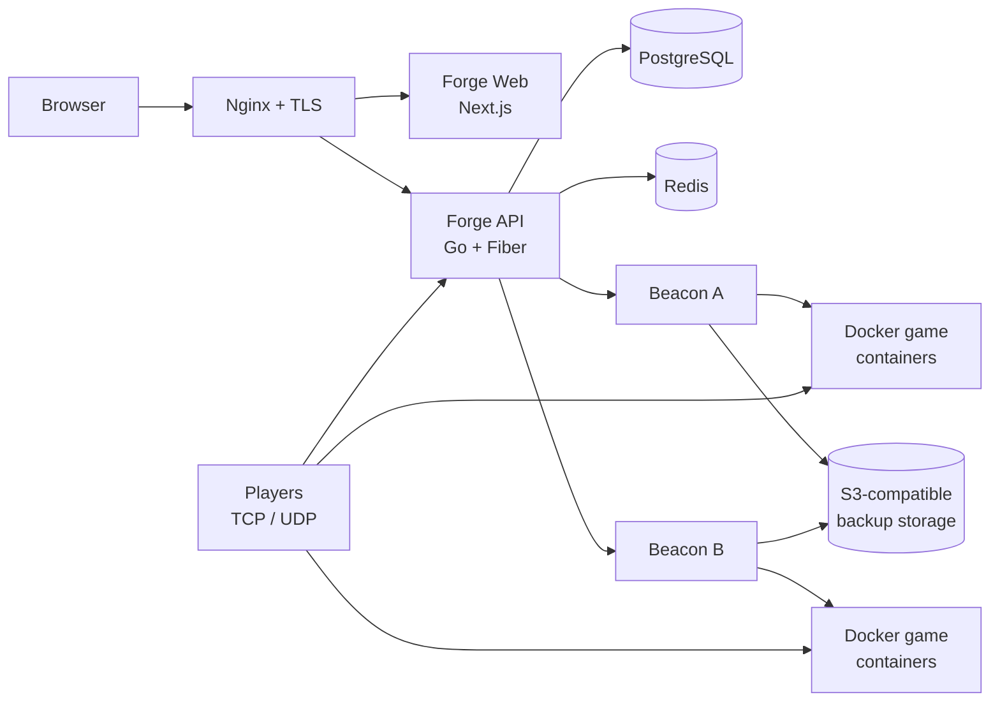

<div align="center">

# ⚔️ GamePanel

### Forge Control Plane · Beacon Node Agent

A modern, self-hosted game-server control plane built with Go, Next.js,
PostgreSQL, Redis, and Docker.

[](#project-status)
[](https://go.dev/)
[](https://nextjs.org/)
[](https://react.dev/)
[](https://www.postgresql.org/)
[](https://www.docker.com/)

[Quick start](#quick-start-for-development) ·
[Ubuntu deployment](#production-deployment-on-ubuntu) ·
[Documentation](#documentation) ·
[Architecture](#architecture) ·
[Testing](#testing-and-quality-checks)

</div>

---

## What is GamePanel?

GamePanel manages game servers across one or more Linux machines. The **Forge**
control plane provides the web dashboard, API, scheduling, placement, recovery,
and administration features. A **Beacon** agent runs on each game node and
controls its Docker workloads, files, console, backups, networking, and SFTP.

It can begin as an all-in-one Ubuntu VPS and grow into a multi-node deployment
with planned evacuation, shared S3-compatible backups, recovery, AWS EC2 node
bootstrap, and TCP/UDP load balancing.

> [!IMPORTANT]
> The recommended production runtime is Docker on Ubuntu. Kubernetes,
> containerd, and Firecracker adapters exist in the codebase, but the documented
> and verified deployment path in this repository is Docker Compose plus Beacon.

## Highlights

| Area | Included capabilities |
|---|---|
| 🎮 Game management | Server lifecycle, console, files, SFTP, schedules, databases, mounts, eggs and startup variables |
| 🌐 Networking | TCP and UDP allocations, container-port remapping, real L4 TCP/UDP target groups and draining |
| 🧭 Orchestration | Placement, reservations, migrations, evacuation, recovery, reconciliation and failover policies |
| 💾 Backups | Local and S3-compatible game backups, verification, retention and PostgreSQL dumps |
| 🔐 Security | First-run setup, sessions, API keys, roles/scopes, TOTP, WebAuthn, rate limits and encryption at rest |
| ☁️ Cloud | AWS EC2 provisioning with automatic Beacon cloud-init bootstrap |
| 📈 Operations | Health endpoints, Prometheus, Grafana, Alertmanager, activity logs and audit events |
| 🌍 Interface | Responsive Next.js dashboard and translations for eight languages |

## Architecture



| Component | Location | Purpose |
|---|---|---|
| Forge API | [`forge/api/`](./forge/api/) | REST API, authentication, persistence and orchestration |
| Forge Web | [`forge/web/`](./forge/web/) | User and administrator dashboard |
| Beacon | [`beacon/`](./beacon/) | Per-node Docker, filesystem, console, backup and SFTP agent |
| Infrastructure | [`infra/`](./infra/) | Compose, Nginx, monitoring, bootstrap and backup configuration |
| Shared packages | [`packages/`](./packages/) | TypeScript SDK, API types and UI primitives |
| Documentation | [`docs/`](./docs/) | Architecture, operations, API, development and historical audits |

## Choose your installation

| Goal | Recommended method | What you need |
|---|---|---|
| Evaluate or contribute locally | Development launcher | Go, Node.js, npm and Docker Desktop/Engine |
| Host everything on one VPS | Production Compose | Ubuntu, Docker Engine, Compose v2, domain and TLS |
| Add game capacity | Standalone Beacon | A second Linux VPS, Docker and a panel-issued node credential |
| Test offline recovery | Two Beacons + shared object storage | S3-compatible bucket accessible from both nodes |
| Provision AWS nodes | Forge cloud module | AWS credentials/role, VPC settings and a published Beacon image |

## Requirements and downloads

### For local development

- [Git](https://git-scm.com/downloads)
- [Go 1.26 or newer](https://go.dev/dl/)
- [Node.js 20 LTS or newer](https://nodejs.org/en/download)
- npm, included with Node.js
- [Docker Desktop](https://www.docker.com/products/docker-desktop/) on macOS/Windows, or [Docker Engine](https://docs.docker.com/engine/install/) on Linux
- Docker Compose v2

Recommended: 4 CPU cores, 8 GiB RAM, 20 GiB free disk space, `curl`, and
OpenSSL.

### For an Ubuntu production host

- Ubuntu 24.04 LTS, 64-bit
- Docker Engine and Docker Compose **2.24.4+**
- Git, curl, ca-certificates, OpenSSL, Nginx and Certbot
- A domain name with an `A`/`AAAA` record pointing to the VPS
- SMTP credentials if password-reset email is required
- An S3-compatible bucket for multi-node disaster recovery

| Deployment | Suggested minimum |
|---|---|
| Small all-in-one panel and a few light servers | 4 vCPU, 8 GiB RAM, 80 GiB SSD |
| Dedicated control plane | 2–4 vCPU, 4–8 GiB RAM, 40 GiB SSD |
| Beacon game node | Determined by the games; reserve at least 1 GiB RAM for the OS and Beacon |

Game workloads consume most of the memory and storage. Size nodes for peak
player load, backups, world growth, and container image cache—not only idle use.

## Quick start for development

### 1. Download the source and dependencies

```bash
git clone <repository-url> gamepanel
cd gamepanel
npm ci
go work sync
```

### 2. Start the development stack

Make sure Docker is running, then use the managed launcher:

```bash
npm run dev:start
```

The launcher starts PostgreSQL and Redis in Docker, then runs Forge API, Beacon,
and Forge Web from source. Open [http://localhost:3000/setup](http://localhost:3000/setup)
to create the first administrator.

```bash
npm run dev:status   # show component status
npm run dev:logs     # follow development logs
npm run dev:stop     # stop managed development processes
```

If PostgreSQL and Redis already run locally, use:

```bash
./scripts/start-dev.sh native
```

### Local service addresses

| Service | Address |
|---|---|
| Web dashboard | `http://localhost:3000` |
| First-run setup | `http://localhost:3000/setup` |
| Forge API | `http://localhost:8080/api/v1` |
| API health | `http://localhost:8080/api/v1/health/ready` |
| Swagger UI | `http://localhost:8080/api/docs` |
| Beacon health | `http://localhost:9090/health` |
| Beacon SFTP | `localhost:2022` |
| PostgreSQL | `localhost:5432` |
| Redis | `localhost:6379` |

## Production deployment on Ubuntu

The complete copy-and-paste installation, firewall, TLS, second-node, AWS,
load-balancer, evacuation and recovery instructions live in the
**[Ubuntu production deployment runbook](./docs/operations/production-deployment.md)**.

The short version is:

```bash
git clone <repository-url> gamepanel
cd gamepanel/infra

# Generates API, database, encryption, node and Grafana secrets.
PANEL_DOMAIN=panel.example.com ./gen-env.sh .env

sudo install -d -o "$USER" -g "$USER" \
  /srv/game-panel/servers \
  /var/backups/gamepanel/postgres

./bootstrap-control-plane.sh
```

The bootstrap intentionally starts the database, API, and web interface first.
Until HTTPS is configured, reach the loopback-only web interface with an SSH
tunnel (`ssh -L 3000:127.0.0.1:3000 user@your-vps`) and open
`http://localhost:3000/setup`. Create the local node in **Admin → Nodes**, and
replace
`DAEMON_NODE_ID` and `DAEMON_NODE_TOKEN` in `infra/.env` with the values issued
by the panel. Then start the complete production stack:

```bash
docker compose \
  -f compose.yml \
  -f compose.production.yml \
  --env-file .env \
  up -d --build

docker compose \
  -f compose.yml \
  -f compose.production.yml \
  --env-file .env \
  ps
```

Production Compose keeps PostgreSQL, Redis, Forge Web, Forge API, Beacon API,
Prometheus, Grafana, and Alertmanager private or loopback-only. Nginx terminates
public HTTPS. Only explicitly selected SFTP, game, and load-balancer ports
should be exposed.

> [!CAUTION]
> Never deploy `infra/compose.yml` by itself on a public host. Always include
> `infra/compose.production.yml`, protect `infra/.env`, use TLS, configure a
> firewall, and store database/game backups off the VPS.

### Deploy the first game

A fresh installation contains a **Minecraft Java** egg using
`itzg/minecraft-server:java21`.

1. Create the Beacon node.
2. Add a TCP allocation such as `0.0.0.0:25565` with container port `25565`.
3. Create a server in **Admin → Servers** using **Games → Minecraft Java**.
4. Start it from the server console.
5. Confirm it with `docker ps`, container logs, and a Minecraft client.

UDP games are supported: select `udp` on the allocation and provide the actual
container port. TCP and UDP may use the same numeric host port because they are
separate transports.

### Add another Beacon

Create another node in the panel, copy its UUID and credential into a
node-specific `infra/.env` on the additional Ubuntu host, then run:

```bash
cd gamepanel/infra
./bootstrap-beacon.sh
curl --fail http://127.0.0.1:9090/health
```

See the runbook for the required firewall rules and S3 settings. Planned
evacuation and offline recovery require at least two usable nodes; offline
recovery additionally requires a verified backup accessible from the
destination node.

## Configuration

Do not handcraft production secrets. Generate the environment file with
[`infra/gen-env.sh`](./infra/gen-env.sh) or
[`infra/gen-env.ps1`](./infra/gen-env.ps1), then review it.

| Variable | Purpose |
|---|---|
| `PANEL_URL` | Public HTTPS address used by the panel |
| `API_AUTH_SECRET` | API signing/authentication secret |
| `APP_KEY` | Application-level secret |
| `DATABASE_URL` | Forge PostgreSQL connection string |
| `FORGE_MASTER_KEY` | Encryption-at-rest master key |
| `DAEMON_NODE_ID` | Node UUID created in Forge |
| `DAEMON_NODE_TOKEN` | Panel-issued Beacon credential |
| `PANEL_API_URL` | Forge API address reachable from Beacon |
| `GAME_SERVERS_HOST_DIR` | Persistent host directory for game data |
| `BACKUP_ADAPTER` | `local` or `s3` game backup storage |
| `S3_*` | S3 bucket, region, endpoint, prefix and credentials/role settings |
| `LOAD_BALANCER_PORT_MIN/MAX` | Reserved listener range for Forge L4 proxy groups |
| `AWS_*` | Optional EC2 provisioning and Beacon bootstrap settings |

The complete template is [`infra/.env.example`](./infra/.env.example).

### Default production ports

| Port | Protocol | Use | Recommended exposure |
|---|---|---|---|
| 80 / 443 | TCP | HTTP redirect and HTTPS | Public |
| 2022 | TCP | Beacon SFTP | Trusted networks where possible |
| 25565 | TCP | Example Minecraft allocation | Public when used |
| 30000–30100 | TCP/UDP | Integrated load-balancer listeners | Public when used |
| 3000 / 8080 | TCP | Web and API upstreams | Loopback only |
| 9090 | TCP | Beacon API | Private control-plane network only |
| 3001 / 9091 / 9093 | TCP | Grafana, Prometheus, Alertmanager | Loopback/VPN only |
| 5432 / 6379 | TCP | PostgreSQL and Redis | Never public |

Do not assign direct game ports inside the configured load-balancer range on
the same control-plane host.

## Testing and quality checks

Before submitting or deploying a change:

```bash
npm run lint
npm run typecheck
npm test
npm run build

(cd forge/api && go test ./... && go vet ./...)
(cd beacon && go test ./... && go vet ./...)
```

Or use the Makefile:

| Command | Action |
|---|---|
| `make build` | Build Forge API, Beacon and Forge Web |
| `make test` | Run backend, Beacon and frontend tests |
| `make lint` | Run repository lint checks |
| `make format` | Format supported source files |
| `make api-test` | Run Forge API tests only |
| `make beacon-test` | Run Beacon tests only |
| `make web-test` | Run frontend tests only |
| `make clean` | Remove generated build artifacts |

CI definitions are under [`.github/workflows/`](./.github/workflows/). The API
migration validation workflow starts a fresh PostgreSQL database and verifies
that every SQL migration is recorded.

## Repository layout

```text
gamepanel/
├── forge/
│   ├── api/                 # Go control-plane API and SQL migrations
│   └── web/                 # Next.js dashboard
├── beacon/                  # Go node agent
├── infra/                   # Compose, Nginx, monitoring and bootstraps
├── packages/
│   ├── sdk/                 # TypeScript API SDK
│   ├── shared-types/        # Shared contracts
│   └── ui/                  # Shared UI primitives
├── lang/                    # Translation catalogs
├── docs/                    # Maintainer and operator documentation
├── scripts/                 # Development, validation and operations helpers
├── reference/               # Upstream research; not shipped runtime code
├── Makefile
├── go.work
└── package.json
```

## Documentation

| Start here | Description |
|---|---|
| [Documentation index](./docs/README.md) | Map of the documentation tree |
| [Production deployment](./docs/operations/production-deployment.md) | Ubuntu, TLS, Docker, games, multi-node, AWS and backups |
| [Security operations](./docs/operations/security.md) | Security controls and operator guidance |
| [Architecture overview](./docs/architecture/architecture-overview.md) | System components and boundaries |
| [Current architecture](./docs/architecture/current-architecture.md) | Implemented runtime architecture |
| [Domain model](./docs/architecture/domain-model.md) | Core orchestration entities and relationships |
| [Developer setup](./docs/development/development.md) | Source development workflow |
| [API guide](./docs/api/api.md) | API conventions and usage |
| [API contracts](./docs/api/API_CONTRACTS.md) | Shared request and response contracts |
| [Server lifecycle](./forge/api/docs/server-lifecycle.md) | Provisioning and runtime lifecycle |
| [Encryption at rest](./forge/api/docs/encryption-at-rest.md) | Master-key management and rotation |
| [OpenAPI specification](./forge/api/docs/openapi.json) | Machine-readable API schema |
| [Architecture decisions](./docs/adr/README.md) | Important technical decisions |

Documents in `docs/archive/`, `docs/audits/`, `docs/comparative-audit/`, and
`reference/` preserve research and historical state. For current deployment
instructions, prefer `docs/operations/production-deployment.md`.

## Security checklist

- Generate secrets; never reuse development values.
- Keep `infra/.env` outside version control and back it up securely.
- Put Forge Web and Forge API behind HTTPS.
- Restrict Beacon port 9090 to the control-plane network or VPN.
- Never expose PostgreSQL, Redis, Prometheus, or Grafana directly.
- Use an IAM role or narrowly scoped S3 credentials for backups.
- Store PostgreSQL dumps and verified game backups off-host.
- Test recovery before relying on it.
- Review image tags and dependency updates before production rollout.
- Run [`scripts/production-guard.sh`](./scripts/production-guard.sh) against the
  loaded production environment before deployment.

Report security-sensitive problems privately to the repository owner instead
of publishing credentials or exploit details in a public issue.

## Troubleshooting

| Problem | Check |
|---|---|
| Docker command cannot connect | Start Docker Desktop/Engine and verify `docker info` |
| API does not become ready | Inspect `docker compose logs api postgres` and validate all required secrets |
| Beacon stays offline | Confirm node UUID/token, `PANEL_API_URL`, time sync and private firewall rules |
| Game port is unreachable | Check allocation protocol, container port, Docker publishing, VPS firewall and provider security group |
| Recovery has no target | Bring a second Beacon online, add capacity/allocations and verify a shared backup exists |
| Load-balancer group does not listen | Enable it, choose a port inside the reserved range and ensure the port is not already allocated |
| Web UI cannot reach API | Verify Nginx routing and `NEXT_PUBLIC_API_URL` for source builds |

Useful commands:

```bash
./scripts/diagnose.sh
./scripts/status.sh
./scripts/logs.sh

cd infra
docker compose -f compose.yml -f compose.production.yml --env-file .env ps
docker compose -f compose.yml -f compose.production.yml --env-file .env logs --tail 200
```

## Project status

GamePanel is under active development. The Docker Compose production path,
TCP/UDP allocations, integrated L4 proxy, multi-node evacuation, shared-backup
recovery, and AWS Beacon bootstrap are implemented. Operators should still use
staged upgrades, off-host backups, monitoring, and recovery drills before
hosting critical workloads.

## Contributing

1. Read [`CONTRIBUTING.md`](./CONTRIBUTING.md).
2. Create a focused branch.
3. Add or update tests with the change.
4. Run the checks in [Testing and quality checks](#testing-and-quality-checks).
5. Document operational or configuration changes.
6. Open a pull request with a concise explanation and verification evidence.

## License

This repository is proprietary software. All rights are reserved unless the
repository owner provides a separate license. Material under `reference/` keeps
the licensing terms of its respective upstream project.

---

<div align="center">

Made with ❤️ by **Riyaz**

<sub>Go · Next.js · React · TypeScript · PostgreSQL · Redis · Docker</sub>

</div>
