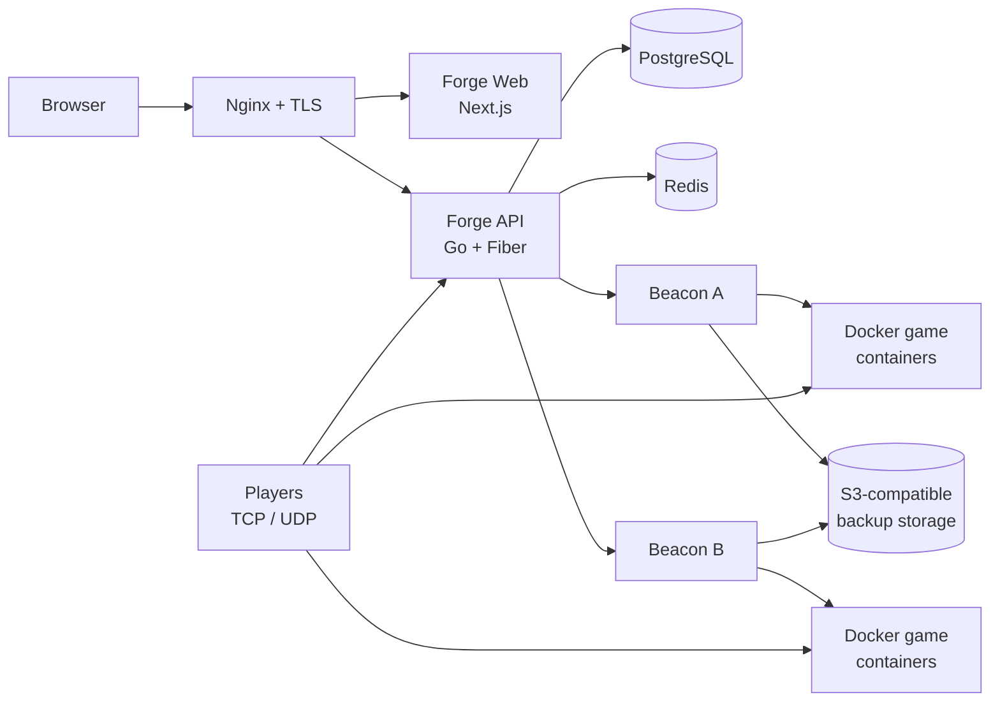

<div align="center">

# GamePanel

### Forge Control Plane · Beacon Node Agent

A modern, self-hosted **game-server control plane** built with Go, Next.js,
PostgreSQL, Redis, and Docker.

[](#project-status)
[](./package.json)
[](https://go.dev/)
[](https://nextjs.org/)
[](https://react.dev/)
[](https://www.postgresql.org/)
[](https://www.docker.com/)
[](https://nodejs.org/)

[Quick start](#-quick-start-development) ·
[Production](#-production-deployment-ubuntu) ·
[Architecture](#-architecture) ·
[Configuration](#-configuration) ·
[Contributing](#-contributing)

</div>

---

## Table of contents

- [What is GamePanel?](#what-is-gamepanel)
- [Highlights](#-highlights)
- [Architecture](#-architecture)
- [Choose your installation](#-choose-your-installation)
- [Requirements](#-requirements)
- [Quick start (development)](#-quick-start-development)
- [Production deployment (Ubuntu)](#-production-deployment-ubuntu)
- [Configuration](#-configuration)
- [Repository layout](#-repository-layout)
- [Testing & quality](#-testing--quality)
- [Security checklist](#-security-checklist)
- [Troubleshooting](#-troubleshooting)
- [Project status](#-project-status)
- [Contributing](#-contributing)
- [License](#-license)

---

## What is GamePanel?

**GamePanel** manages game servers across one or more Linux machines.

| Piece | Role |
|---|---|
| **Forge** | Control plane — web dashboard, REST API, scheduling, placement, recovery, and administration |
| **Beacon** | Per-node agent — Docker workloads, files, console, backups, networking, and SFTP |

Start on a single Ubuntu VPS and grow into a multi-node fleet with planned
evacuation, shared S3-compatible backups, recovery, AWS EC2 node bootstrap, and
TCP/UDP load balancing.

> [!IMPORTANT]
> The supported production runtime is **Docker on Ubuntu**. Kubernetes,
> containerd, and Firecracker adapters may exist in the codebase, but the
> documented and verified path is **Docker Compose + Beacon**.

---

## ✨ Highlights

| Area | Capabilities |
|---|---|
| 🎮 **Game management** | Server lifecycle, live console, files, SFTP, schedules, databases, mounts, eggs & startup variables |
| 🌐 **Networking** | TCP/UDP allocations, container-port remapping, L4 TCP/UDP target groups with draining |
| 🧭 **Orchestration** | Placement, reservations, migrations, evacuation, recovery, reconciliation & failover policies |
| 💾 **Backups** | Local and S3-compatible game backups, verification, retention, PostgreSQL dumps |
| 🔐 **Security** | First-run setup, sessions, API keys, roles/scopes, TOTP, WebAuthn, rate limits, encryption at rest |
| ☁️ **Cloud** | AWS EC2 provisioning with automatic Beacon cloud-init bootstrap |
| 📈 **Operations** | Health endpoints, Prometheus, Grafana, Alertmanager, activity logs & audit events |
| 🌍 **Interface** | Responsive Next.js dashboard · translations in **8 languages** (en, de, es, fr, ja, pt, ru, zh) |

---

## 🏗 Architecture


```mermaid
flowchart LR
    Player["Players<br/>TCP / UDP"]
    Browser["Browser"]
    Proxy["Nginx + TLS"]
    Web["Forge Web<br/>Next.js"]
    API["Forge API<br/>Go + Fiber"]
    DB[("PostgreSQL")]
    Cache[("Redis")]
    S3[("S3-compatible<br/>backup storage")]
    BeaconA["Beacon A"]
    BeaconB["Beacon B"]
    GamesA["Docker game<br/>containers"]
    GamesB["Docker game<br/>containers"]

    Browser --> Proxy
    Proxy --> Web
    Proxy --> API
    API --> DB
    API --> Cache
    API --> BeaconA
    API --> BeaconB
    BeaconA --> GamesA
    BeaconB --> GamesB
    BeaconA --> S3
    BeaconB --> S3
    Player --> GamesA
    Player --> GamesB
    Player --> API
```

| Component | Path | Purpose |
|---|---|---|
| **Forge API** | [`forge/api/`](./forge/api/) | REST API, auth, persistence, orchestration (Go + Fiber) |
| **Forge Web** | [`forge/web/`](./forge/web/) | User & admin dashboard (Next.js 15 + React 19) |
| **Beacon** | [`beacon/`](./beacon/) | Per-node Docker, filesystem, console, backup & SFTP agent |
| **Infrastructure** | [`infra/`](./infra/) | Compose, Nginx, monitoring, bootstrap & backup config |
| **Shared packages** | [`packages/`](./packages/) | TypeScript SDK, shared types, UI primitives |
| **Translations** | [`lang/`](./lang/) | i18n catalogs (Crowdin-ready) |
| **Scripts** | [`scripts/`](./scripts/) | Dev launcher, lint, diagnose, production guards |

---

## 🗺 Choose your installation

| Goal | Method | You need |
|---|---|---|
| Evaluate or contribute | Dev launcher | Go 1.26+, Node 20+, npm, Docker |
| Host everything on one VPS | Production Compose | Ubuntu, Docker Engine, Compose v2, domain + TLS |
| Add game capacity | Standalone Beacon | Extra Linux VPS, Docker, panel-issued node credential |
| Offline recovery drills | Two Beacons + shared object storage | S3-compatible bucket reachable from both nodes |
| Provision AWS nodes | Forge cloud module | AWS credentials/role, VPC settings, published Beacon image |

---

## 📦 Requirements

### Local development

| Tool | Version |
|---|---|
| [Git](https://git-scm.com/downloads) | any recent |
| [Go](https://go.dev/dl/) | **1.26+** |
| [Node.js](https://nodejs.org/en/download) | **20 LTS+** (npm included) |
| [Docker](https://www.docker.com/) | Desktop (macOS/Windows) or Engine (Linux) |
| Docker Compose | **v2** |

**Recommended hardware:** 4 CPU cores · 8 GiB RAM · 20 GiB free disk · `curl` · OpenSSL

### Ubuntu production host

- Ubuntu **24.04 LTS** (64-bit)
- Docker Engine + Docker Compose **2.24.4+**
- Git, curl, ca-certificates, OpenSSL, Nginx, Certbot
- Domain with an `A`/`AAAA` record pointing at the VPS
- SMTP credentials (optional — password-reset email)
- S3-compatible bucket (recommended for multi-node disaster recovery)

| Deployment size | Suggested minimum |
|---|---|
| Small all-in-one (panel + a few light servers) | 4 vCPU · 8 GiB RAM · 80 GiB SSD |
| Dedicated control plane | 2–4 vCPU · 4–8 GiB RAM · 40 GiB SSD |
| Beacon game node | Sized for the games; reserve ≥ 1 GiB RAM for OS + Beacon |

> Game workloads dominate memory and disk. Size nodes for **peak player load**,
> backups, world growth, and image cache — not idle footprint.

---

## 🚀 Quick start (development)

### 1. Clone and install

```bash
git clone https://github.com/ryzenate1/forge-control-plane.git gamepanel
cd gamepanel

npm ci
go work sync
```

### 2. Start the stack

Ensure Docker is running, then launch everything with one command:

```bash
npm run dev:start
# equivalent: ./scripts/start-dev.sh
```

The launcher starts **PostgreSQL + Redis** in Docker, then runs **Forge API**,
**Beacon**, and **Forge Web** from source.

Open **[http://localhost:3000/setup](http://localhost:3000/setup)** and create
the first administrator.

```bash
npm run dev:status   # component status
npm run dev:logs     # follow logs
npm run dev:stop     # stop managed processes
```

If PostgreSQL and Redis already run on the host:

```bash
./scripts/start-dev.sh native
```

Windows PowerShell alternative:

```powershell
.\start-dev.ps1
```

### Local service map

| Service | Address |
|---|---|
| Web dashboard | http://localhost:3000 |
| First-run setup | http://localhost:3000/setup |
| Forge API | http://localhost:8080/api/v1 |
| API readiness | http://localhost:8080/api/v1/health/ready |
| Swagger UI | http://localhost:8080/api/docs |
| OpenAPI (JSON) | http://localhost:8080/api/docs/openapi.json |
| Beacon health | http://localhost:9090/health |
| Beacon SFTP | `localhost:2022` |
| PostgreSQL | `localhost:5432` |
| Redis | `localhost:6379` |

---

## 🖥 Production deployment (Ubuntu)

### 1. Install host dependencies

```bash
sudo apt-get update
sudo apt-get install -y ca-certificates curl git nginx certbot

sudo install -m 0755 -d /etc/apt/keyrings
sudo curl -fsSL https://download.docker.com/linux/ubuntu/gpg \
  -o /etc/apt/keyrings/docker.asc
sudo chmod a+r /etc/apt/keyrings/docker.asc

echo "deb [arch=$(dpkg --print-architecture) signed-by=/etc/apt/keyrings/docker.asc] \
https://download.docker.com/linux/ubuntu \
$(. /etc/os-release && echo "$VERSION_CODENAME") stable" \
  | sudo tee /etc/apt/sources.list.d/docker.list >/dev/null

sudo apt-get update
sudo apt-get install -y docker-ce docker-ce-cli containerd.io \
  docker-buildx-plugin docker-compose-plugin

sudo usermod -aG docker "$USER"
```

Log out and back in so the Docker group takes effect.

### 2. Bootstrap the control plane

```bash
git clone https://github.com/ryzenate1/forge-control-plane.git gamepanel
cd gamepanel/infra

# Generates API, database, encryption, node, and Grafana secrets
PANEL_DOMAIN=panel.example.com ./gen-env.sh .env

sudo install -d -o "$USER" -g "$USER" \
  /srv/game-panel/servers \
  /var/backups/gamepanel/postgres

./bootstrap-control-plane.sh
```

Bootstrap starts **Postgres → API → Web** first. Until HTTPS is configured,
reach the loopback-only UI over an SSH tunnel:

```bash
ssh -L 3000:127.0.0.1:3000 user@your-vps
# then open http://localhost:3000/setup
```

1. Complete `/setup` and create the first admin.
2. Create the local node under **Admin → Nodes**.
3. Copy the issued UUID + token into `infra/.env` as
   `DAEMON_NODE_ID` and `DAEMON_NODE_TOKEN`.
4. Bring up the full production stack:

```bash
docker compose \
  -f compose.yml \
  -f compose.production.yml \
  --env-file .env \
  up -d --build

docker compose \
  -f compose.yml \
  -f compose.production.yml \
  --env-file .env \
  ps
```

Production Compose keeps PostgreSQL, Redis, Forge Web, Forge API, Beacon API,
Prometheus, Grafana, and Alertmanager **private / loopback-only**. Nginx
terminates public HTTPS. Only the SFTP, game, and load-balancer ports you
explicitly choose should be public.

### 3. Firewall

Allow SSH, HTTP, HTTPS, SFTP, and only the game / L4 ranges you actually use:

```bash
sudo ufw allow OpenSSH
sudo ufw allow 80/tcp
sudo ufw allow 443/tcp
sudo ufw allow 2022/tcp
sudo ufw allow 25565/tcp
sudo ufw allow 30000:30100/tcp
sudo ufw allow 30000:30100/udp
sudo ufw enable
```

### 4. TLS + Nginx

After DNS points at the VPS:

```bash
cd gamepanel/infra
sudo systemctl stop nginx
sudo certbot certonly --standalone -d panel.example.com

sed 's/__PANEL_FQDN__/panel.example.com/g' nginx.conf \
  | sudo tee /etc/nginx/nginx.conf >/dev/null

sudo nginx -t
sudo systemctl enable --now nginx
```

> [!CAUTION]
> Never deploy `infra/compose.yml` alone on a public host. Always pair it with
> `infra/compose.production.yml`, protect `infra/.env`, terminate TLS, lock down
> the firewall, and keep database / game backups **off** the VPS.

### 5. Deploy the first game

A fresh install ships a **Minecraft Java** egg (`itzg/minecraft-server:java21`).

1. Ensure the Beacon node is online.
2. Add a TCP allocation, e.g. `0.0.0.0:25565` → container port `25565`.
3. Create a server in **Admin → Servers** using **Games → Minecraft Java**.
4. Start it from the server console.
5. Verify with `docker ps`, container logs, and a Minecraft client.

UDP games work the same way — set the allocation protocol to `udp` and the real
container port. TCP and UDP may share a numeric host port (separate transports).

### 6. Add another Beacon node

On the additional Ubuntu host:

```bash
cd gamepanel/infra
# Put the panel-issued node UUID/token + reachable PANEL_API_URL into .env
./bootstrap-beacon.sh
curl --fail http://127.0.0.1:9090/health
```

Planned evacuation and offline recovery need **at least two usable nodes**.
Offline recovery also needs a **verified backup** reachable from the destination
node (shared S3-compatible storage recommended).

---

## ⚙ Configuration

Do **not** handcraft production secrets. Generate them:

```bash
# Linux / macOS
PANEL_DOMAIN=panel.example.com ./infra/gen-env.sh infra/.env

# Windows PowerShell
.\infra\gen-env.ps1
```

Review the file, keep it **out of Git**, and store a protected recovery copy.

### Key environment variables

| Variable | Purpose |
|---|---|
| `PANEL_URL` | Public HTTPS URL of the panel |
| `API_AUTH_SECRET` | API signing / authentication secret |
| `APP_KEY` | Application-level secret |
| `DATABASE_URL` | Forge PostgreSQL connection string |
| `FORGE_MASTER_KEY` | Encryption-at-rest master key |
| `FORGE_MASTER_KEY_ID` | Key identifier (default `primary`) |
| `DAEMON_NODE_ID` | Node UUID created in Forge |
| `DAEMON_NODE_TOKEN` | Panel-issued Beacon credential |
| `PANEL_API_URL` | Forge API URL reachable from Beacon |
| `GAME_SERVERS_HOST_DIR` | Persistent host directory for game data |
| `BACKUP_ADAPTER` | `local` or `s3` |
| `S3_*` | Bucket, region, endpoint, prefix, credentials/role |
| `LOAD_BALANCER_PORT_MIN` / `MAX` | Reserved listener range for Forge L4 proxy |
| `AWS_*` | Optional EC2 provisioning & Beacon bootstrap |

### Default production ports

| Port | Protocol | Use | Exposure |
|---|---|---|---|
| 80 / 443 | TCP | HTTP redirect + HTTPS | **Public** |
| 2022 | TCP | Beacon SFTP | Trusted networks where possible |
| 25565 | TCP | Example Minecraft allocation | Public when used |
| 30000–30100 | TCP/UDP | Integrated load-balancer listeners | Public when used |
| 3000 / 8080 | TCP | Web + API upstreams | **Loopback only** |
| 9090 | TCP | Beacon API | **Private control-plane network** |
| 3001 / 9091 / 9093 | TCP | Grafana / Prometheus / Alertmanager | Loopback / VPN only |
| 5432 / 6379 | TCP | PostgreSQL / Redis | **Never public** |

Do not assign direct game ports inside the configured load-balancer range on the
same control-plane host.

---

## 📁 Repository layout

```text
gamepanel/
├── forge/
│   ├── api/                 # Go control-plane API + SQL migrations
│   └── web/                 # Next.js dashboard
├── beacon/                  # Go node agent (Docker runtime, SFTP, backups)
├── infra/                   # Compose, Nginx, monitoring, bootstraps
│   ├── compose.yml
│   ├── compose.production.yml
│   ├── compose.beacon.yml
│   ├── gen-env.sh / gen-env.ps1
│   ├── bootstrap-control-plane.sh
│   ├── bootstrap-beacon.sh
│   ├── nginx.conf
│   ├── prometheus/ · grafana/ · alertmanager.yml
│   └── postgres-backup.sh
├── packages/
│   ├── sdk/                 # @forge/sdk — TypeScript API client
│   ├── shared-types/        # @forge/shared-types — shared contracts
│   └── ui/                  # @forge/ui — shared UI primitives
├── lang/                    # Translation catalogs (en, de, es, fr, ja, pt, ru, zh)
├── scripts/                 # Dev, lint, diagnose, production helpers
├── config/                  # Shared config examples
├── Makefile
├── go.work
├── package.json             # npm workspaces root
├── start-dev.sh / .ps1      # Convenience launchers
└── CONTRIBUTING.md
```

---

## 🧪 Testing & quality

Before opening a PR or promoting a build:

```bash
# Frontend / monorepo
npm run lint
npm run typecheck
npm test
npm run build

# Backend
(cd forge/api && go test ./... && go vet ./...)
(cd beacon && go test ./... && go vet ./...)
```

### Makefile targets

| Command | Action |
|---|---|
| `make build` | Build Forge API, Beacon, and Forge Web |
| `make test` | Run API, Beacon, and frontend tests |
| `make lint` | Repository lint checks |
| `make format` | Format supported source files |
| `make api-test` | Forge API tests only |
| `make beacon-test` | Beacon tests only |
| `make web-test` | Frontend tests only |
| `make clean` | Remove generated build artifacts |

Production validation should also start a **fresh PostgreSQL** instance and
confirm every migration under `forge/api/migrations/` applies cleanly before an
image is promoted.

Useful ops helpers:

```bash
./scripts/diagnose.sh
./scripts/status.sh
./scripts/logs.sh
./scripts/production-guard.sh   # validate loaded production env
```

---

## 🔒 Security checklist

- [ ] Generate secrets with `infra/gen-env.sh` — never reuse development values
- [ ] Keep `infra/.env` out of version control; back it up securely offline
- [ ] Terminate Forge Web and Forge API behind HTTPS
- [ ] Restrict Beacon port **9090** to the control-plane network / VPN
- [ ] Never expose PostgreSQL, Redis, Prometheus, or Grafana publicly
- [ ] Use an IAM role or narrowly scoped credentials for S3 backups
- [ ] Store PostgreSQL dumps and verified game backups **off-host**
- [ ] Run recovery drills before relying on them
- [ ] Review image tags and dependency updates before production rollout
- [ ] Run [`scripts/production-guard.sh`](./scripts/production-guard.sh) against the loaded production environment

Report security-sensitive issues **privately** to the repository owner. Do not
publish credentials or exploit details in public issues.

---

## 🛠 Troubleshooting

| Problem | What to check |
|---|---|
| Docker cannot connect | Start Docker Desktop/Engine; run `docker info` |
| API never becomes ready | `docker compose logs api postgres`; confirm all required secrets are set |
| Beacon stays offline | Node UUID/token, `PANEL_API_URL`, clock sync, private firewall rules |
| Game port unreachable | Allocation protocol & container port, Docker publish, VPS firewall, cloud SG |
| Recovery has no target | Second Beacon online, free capacity/allocations, shared backup verified |
| Load-balancer group silent | Enabled, port inside reserved range, port not already allocated |
| Web UI cannot reach API | Nginx routing; for source builds, `NEXT_PUBLIC_API_URL` |

```bash
# Dev
./scripts/diagnose.sh
./scripts/status.sh
./scripts/logs.sh

# Production
cd infra
docker compose -f compose.yml -f compose.production.yml --env-file .env ps
docker compose -f compose.yml -f compose.production.yml --env-file .env logs --tail 200
```

---

## 📌 Project status

GamePanel is under **active development** (v0.1.0).

**Implemented today**

- Docker Compose production path
- TCP/UDP allocations
- Integrated L4 proxy
- Multi-node evacuation
- Shared-backup recovery
- AWS Beacon bootstrap
- Durable operations & Beacon command recovery

Operators should still use staged upgrades, off-host backups, monitoring, and
recovery drills before hosting critical workloads.

---

## 🤝 Contributing

1. Read [`CONTRIBUTING.md`](./CONTRIBUTING.md).
2. Create a focused branch from `main`.
3. Add or update tests with the change.
4. Run the checks in [Testing & quality](#-testing--quality).
5. Document any operational or configuration changes.
6. Open a pull request with a concise explanation and verification evidence.

**Commit style:** conventional commits (`feat:`, `fix:`, `docs:`, `chore:`,
`refactor:`, `test:`).

**Code style**

- Go → `gofmt` / `goimports` (`make format`)
- TypeScript → Prettier / ESLint (`npm run lint`)

---

## 📄 License

This repository is **proprietary software**. All rights reserved unless the
repository owner provides a separate license.

---

<div align="center">

Made with ❤️ by **Riyaz**

<sub>Go · Next.js · React · TypeScript · PostgreSQL · Redis · Docker</sub>

<br/>

[⬆ Back to top](#gamepanel)

</div>
