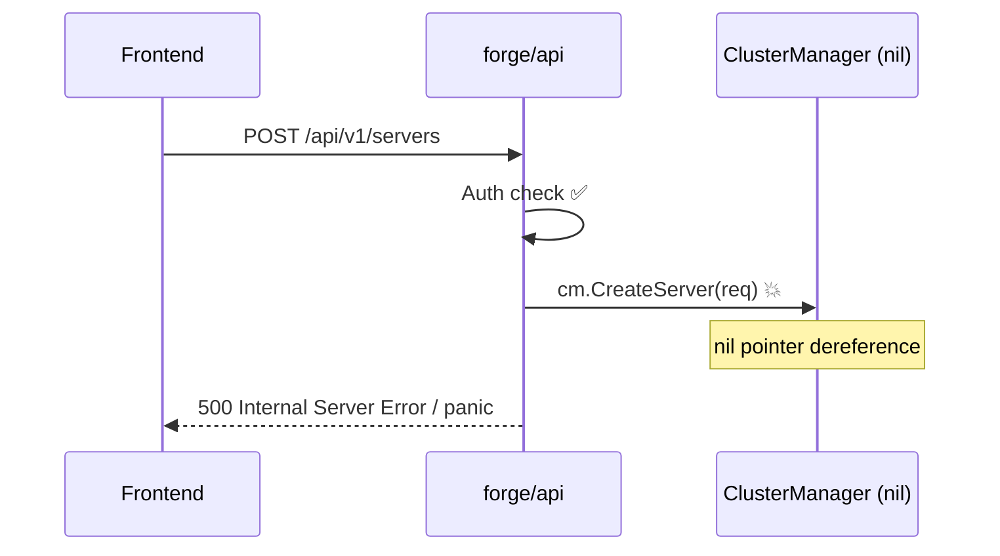
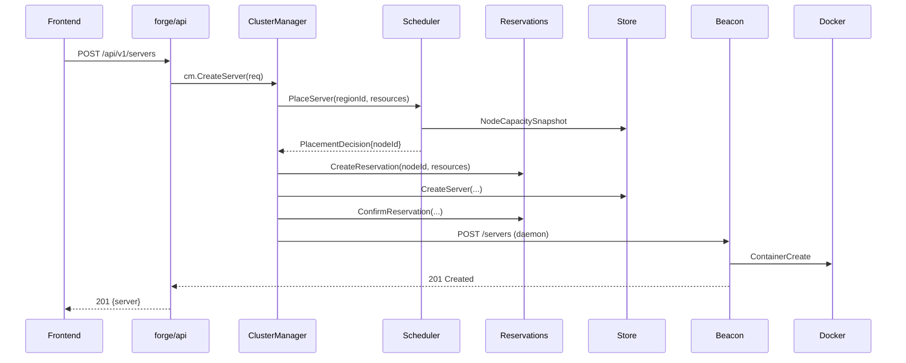
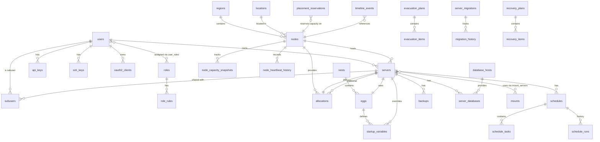

# 02 — Architecture Overview

---

## System Architecture

```mermaid
flowchart TD
    subgraph Client
        Browser[Browser\nNext.js 15 App]
    end

    subgraph forge/web — Frontend
        NextApp[Next.js App Router\nReact 19 + TypeScript]
        TanStack[TanStack Query v5\nServer State]
        Zustand[Zustand v5\nClient State / Auth Token]
        Xterm[xterm.js v5\nTerminal Emulator]
        Monaco[Monaco Editor v0.55\nFile Editor]
    end

    subgraph forge/api — Backend API
        Fiber[Go Fiber v2\nHTTP Router]
        Auth[Auth Middleware\nHMAC-JWT / OAuth2 / API Key]
        HTTPHandlers[HTTP Handlers\n~222 routes]
        ServiceLayer[Service Layer\n12 services]
        StoreLayer[Store Layer\n47 files / pgx]
        DaemonClient[Daemon Client\nHMAC-signed Wings API]
        EventBus[events.Registry\nin-process pub/sub]
    end

    subgraph forge/api — Services
        CM[ClusterManager]
        EP[EvacuationPlanner]
        MIG[Migration Engine]
        RES[Reservations Manager]
        REC[Recovery Coordinator]
        OBS[Observability]
        HBM[Heartbeat Monitor]
        REC2[Reconciler]
        SCHED[Scheduler / Placement]
        NR[NodeRegistry ✅]
        NP[NodeProbe ✅]
        DBP[dbprovisioner ❌ empty]
    end

    subgraph beacon — Daemon
        BeaconHTTP[Go HTTP Server\n41 routes]
        DockerRT[Docker Runtime\ncontainer lifecycle]
        SFTPSrv[SFTP Server\n:2022 / SSH ed25519]
        BackupSys[Backup System\nlocal zip / S3]
        TransferSys[Transfer Manager\ntar.gz + SHA256]
        RemoteClient[Remote Panel Client\noutbound API calls]
    end

    subgraph Infrastructure
        PG[(PostgreSQL\n47 tables)]
        Redis[(Redis\nOptional — rate limiting)]
        DockerD[(Docker Daemon)]
    end

    Browser --> NextApp
    NextApp --> TanStack
    NextApp --> Zustand
    NextApp --> Xterm
    NextApp --> Monaco

    TanStack -->|REST API calls| Fiber
    Fiber --> Auth
    Auth --> HTTPHandlers
    HTTPHandlers --> ServiceLayer
    HTTPHandlers --> StoreLayer
    HTTPHandlers --> DaemonClient
    ServiceLayer --> EventBus
    ServiceLayer --> StoreLayer
    StoreLayer --> PG
    Auth --> Redis

    DaemonClient -->|HMAC-signed HTTP| BeaconHTTP
    BeaconHTTP --> DockerRT
    BeaconHTTP --> SFTPSrv
    BeaconHTTP --> BackupSys
    BeaconHTTP --> TransferSys
    BeaconHTTP --> RemoteClient
    DockerRT --> DockerD

    ServiceLayer --> CM & EP & MIG & RES & REC & OBS & HBM & REC2 & SCHED & NR & NP & DBP

    style CM fill:#ff6b6b,color:#fff
    style EP fill:#ff6b6b,color:#fff
    style MIG fill:#ff6b6b,color:#fff
    style RES fill:#ff6b6b,color:#fff
    style REC fill:#ff6b6b,color:#fff
    style OBS fill:#ff6b6b,color:#fff
    style HBM fill:#ffa94d,color:#fff
    style REC2 fill:#ffa94d,color:#fff
    style SCHED fill:#ffa94d,color:#fff
    style DBP fill:#868e96,color:#fff
```

> 🔴 Red = Code complete but wired as nil — panics on any route call  
> 🟠 Orange = Code complete but never started (goroutine never launched)  
> ⚫ Grey = Empty package (placeholder only)  
> ✅ Green = Wired and running

---

## Module Structure

```
gamepanel/
├── forge/
│   ├── api/                     Go module: gamepanel/forge
│   │   ├── cmd/api/main.go      Entry point — wires only 2/12 services
│   │   ├── internal/
│   │   │   ├── domain/          Shared value types and enums
│   │   │   ├── http/            Fiber handlers and middleware (~25 files)
│   │   │   ├── services/        12 service packages
│   │   │   ├── store/           47 store files (pgx / PostgreSQL)
│   │   │   ├── daemon/          Wings HTTP client (HMAC-signed)
│   │   │   ├── events/          In-process pub/sub registry
│   │   │   ├── realtime/        README placeholder only — no Go files
│   │   │   └── runtime/         Runtime abstraction + Docker impl
│   │   └── migrations/          36 SQL migration files
│   └── web/                     Next.js 15 frontend
│       ├── app/
│       │   ├── page.tsx         Login page
│       │   ├── setup/           First-run wizard
│       │   ├── admin/           17 admin section pages
│       │   └── server/[id]/     10 server management pages
│       ├── components/
│       │   ├── admin/           19 admin components
│       │   ├── server/          17 server components (5 are dead code)
│       │   └── ui/              3 shared primitives
│       ├── lib/
│       │   ├── api.ts           ~1,860 line API client (~120 functions)
│       │   └── wings-sign.ts    HMAC signing utility
│       └── stores/
│           └── use-server-store.ts  Zustand store (auth + console state)
├── beacon/                      Go module: beacon
│   ├── cmd/daemon/main.go       Entry point — Docker + SFTP + HTTP + heartbeat
│   └── internal/
│       ├── server/              HTTP API (41 routes) + state machine
│       ├── runtime/             Docker SDK integration
│       ├── backup/              Local zip + S3 (S3 broken)
│       ├── sftpserver/          SSH/SFTP server
│       ├── transfer/            Server-to-server transfer
│       ├── remote/              Outbound panel API client
│       ├── events/              In-process pub/sub (unused)
│       ├── ignore/              .pteroignore parser
│       └── system/              AtomicString/Bool, Locker (unused)
└── reference/
    ├── petrodactylpanel/        Pterodactyl Panel (PHP/Laravel)
    ├── pelicanpanel/            Pelican Panel (PHP/Laravel fork)
    ├── pufferpanel/             PufferPanel (Go monolith)
    └── wings/                   Pterodactyl Wings (Go daemon)
```

---

## Technology Stack

### Backend API (`forge/api`)

| Layer | Technology | Version |
|---|---|---|
| Language | Go | 1.22+ |
| HTTP Framework | Fiber v2 | v2.52 |
| Database | PostgreSQL via pgx | v5 |
| Auth (JWT) | golang-jwt/jwt | v5 |
| Auth (bcrypt) | golang.org/x/crypto | latest |
| Redis | go-redis/v9 | v9 |
| UUID | google/uuid | v1 |
| Cron parsing | robfig/cron | v3 |

### Frontend (`forge/web`)

| Layer | Technology | Version |
|---|---|---|
| Framework | Next.js | 15.3 |
| UI Library | React | 19 |
| Type System | TypeScript | 5.7 |
| Server State | TanStack Query | v5.90 |
| Client State | Zustand | v5.0 |
| Terminal | @xterm/xterm | v5.5 |
| File Editor | Monaco Editor | v0.55 |
| Styling | Tailwind CSS | v3.4 |
| Icons | lucide-react | v0.468 |

### Daemon (`beacon`)

| Layer | Technology | Version |
|---|---|---|
| Language | Go | 1.22+ |
| Docker SDK | docker/docker | v28.5 |
| WebSocket | gorilla/websocket | v1.5.3 |
| SFTP | pkg/sftp | v1.13.10 |
| SSH | golang.org/x/crypto | v0.41 |
| S3 | aws-sdk-go-v2/service/s3 | v1.104 |

---

## Data Flow: Server Creation (Current vs Intended)

### Current (broken — panics)



### Intended (after wiring fix)



---

## Database Schema Overview


