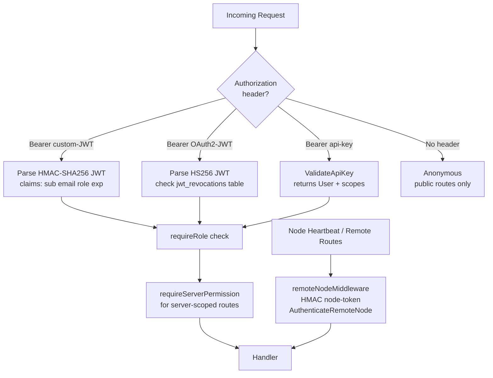

# 03 — Backend Analysis (`forge/api`)

---

## Service Wiring Status

This is the most critical issue in the entire codebase.

| Service | Package | Code Complete | Instantiated | Wired to Routes | Event Bus Connected |
|---|---|---|---|---|---|
| NodeRegistry | `noderegistry` | ✅ | ✅ | ✅ | ❌ |
| NodeProbe | `nodeprobe` | ✅ | ✅ | ✅ | N/A |
| ClusterManager | `clustermanager` | ✅ | ❌ nil | ❌ panics | ❌ |
| EvacuationPlanner | `evacuationplanner` | ✅ | ❌ nil | ❌ panics | ❌ |
| Migration | `migration` | ✅ | ❌ nil | ❌ panics | ❌ |
| Reservations | `reservations` | ✅ | ❌ nil | ❌ panics | ❌ |
| Recovery | `recovery` | ✅ | ❌ nil | ❌ panics | ❌ |
| Observability | `observability` | ✅ | ❌ nil | ❌ panics | ❌ |
| HeartbeatMonitor | `heartbeatmonitor` | ✅ | ❌ not created | ❌ nil guard | ❌ |
| Reconciler | `reconciler` | ✅ | ❌ not created | N/A | ❌ |
| Scheduler | `scheduler` | ✅ | ❌ not created | N/A (via CM) | ❌ |
| Runtime Registry | `runtime` | ✅ | ❌ not created | N/A | ❌ |
| Events Registry | `events` | ✅ | ❌ not created | N/A | N/A |
| DB Provisioner | `dbprovisioner` | ❌ empty dir | ❌ | ❌ | ❌ |
| Schedule Runner | embedded in http | ✅ | ✅ | ✅ | N/A |

---

## Complete API Route Inventory

### Public Routes

| Method | Path | Handler | Status |
|---|---|---|---|
| `GET` | `/api/v1/health` | DB + Redis health check | ✅ |
| `GET` | `/api/v1/metrics` | Prometheus-style plain text | ✅ |
| `POST` | `/api/v1/auth/login` | Email/password → JWT or 2FA checkpoint | ✅ |
| `POST` | `/api/v1/auth/login/checkpoint` | 2FA code → JWT | ✅ |
| `GET` | `/api/v1/setup/status` | Setup wizard status | ✅ |
| `POST` | `/api/v1/setup` | Create initial admin (blocked after first use) | ✅ |
| `POST` | `/api/v1/oauth2/token` | RFC 6749 `client_credentials` grant | ✅ |
| `POST` | `/api/v1/oauth/token` | Alias | ✅ |
| `POST` | `/api/v1/nodes/:id/heartbeat` | Node heartbeat (node-token auth) | ✅ |

### WebSocket Routes (JWT or ticket auth)

| Method | Path | Status |
|---|---|---|
| `GET` | `/api/v1/servers/:id/ws/console` | ✅ Bidirectional WS proxy |
| `GET` | `/api/v1/servers/:id/ws/stats` | ✅ WS proxy |
| `GET` | `/api/v1/servers/:id/ws/logs` | ✅ WS proxy |

### Remote Routes (HMAC node-token auth — Wings API)

| Method | Path | Status |
|---|---|---|
| `GET` | `/api/remote/servers` | ✅ |
| `POST` | `/api/remote/servers/reset` | ✅ |
| `POST` | `/api/remote/sftp/auth` | ✅ |
| `GET` | `/api/remote/servers/:id` | ✅ |
| `GET` | `/api/remote/servers/:id/install` | ✅ |
| `POST` | `/api/remote/servers/:id/install` | ✅ |
| `POST` | `/api/remote/servers/:id/transfer/success` | ✅ |
| `POST` | `/api/remote/servers/:id/transfer/failure` | ✅ |
| `POST` | `/api/remote/servers/:id/backups/status` | ✅ |
| `POST` | `/api/remote/servers/:id/status` | ✅ |
| `POST` | `/api/remote/servers/:id/activity` | ✅ |
| `POST` | `/api/remote/servers/:id/archive` | ✅ |
| `GET` | `/api/remote/servers/:id/transfer` | ✅ |
| `POST` | `/api/remote/activity` | ✅ |
| `GET` | `/api/remote/backups/:backup` | ✅ |
| `POST` | `/api/remote/backups/:backup` | ✅ |
| `POST` | `/api/remote/backups/:backup/restore` | ✅ |

### Protected Routes — Account & Auth

| Method | Path | Status |
|---|---|---|
| `GET` | `/api/v1/auth/me` | ✅ |
| `GET` | `/api/v1/api-keys` | ✅ |
| `POST` | `/api/v1/api-keys` | ✅ |
| `GET` | `/api/v1/admin-scopes` | ✅ |
| `DELETE` | `/api/v1/api-keys/:id` | ✅ |
| `GET` | `/api/v1/ssh-keys` | ✅ |
| `POST` | `/api/v1/ssh-keys` | ✅ |
| `DELETE` | `/api/v1/ssh-keys` | ✅ |
| `GET` | `/api/v1/account/two-factor` | ✅ |
| `POST` | `/api/v1/account/two-factor` | ✅ |
| `DELETE` | `/api/v1/account/two-factor` | ✅ |
| `GET` | `/api/v1/activity` (user) | ✅ |
| `GET` | `/api/v1/account/oauth-clients` | ✅ |
| `POST` | `/api/v1/account/oauth-clients` | ✅ |
| `DELETE` | `/api/v1/account/oauth-clients/:id` | ✅ |

### Protected Routes — Servers

| Method | Path | Status |
|---|---|---|
| `GET` | `/api/v1/servers` | ✅ |
| `POST` | `/api/v1/servers` | ❌ `clusterManager` nil — panics |
| `GET` | `/api/v1/servers/:id` | ✅ |
| `PATCH` | `/api/v1/servers/:id` | ✅ |
| `DELETE` | `/api/v1/servers/:id` | ❌ `clusterManager` nil — panics |
| `POST` | `/api/v1/servers/:id/power` | ❌ `clusterManager` nil — panics |
| `POST` | `/api/v1/servers/:id/command` | ✅ |
| `GET` | `/api/v1/servers/:id/install` | ✅ |
| `POST` | `/api/v1/servers/:id/install` | ✅ |
| `GET` | `/api/v1/servers/:id/stats` | ✅ |
| `GET` | `/api/v1/servers/:id/logs` | ✅ |
| `GET` | `/api/v1/servers/:id/ws/ticket` | ✅ |
| `GET/POST/DELETE` | `/api/v1/servers/:id/files` | ✅ |
| `GET` | `/api/v1/servers/:id/files/read` | ✅ |
| `POST` | `/api/v1/servers/:id/files/mkdir` | ✅ |
| `POST` | `/api/v1/servers/:id/files/rename` | ✅ |
| `POST` | `/api/v1/servers/:id/files/archive` | ✅ |
| `POST` | `/api/v1/servers/:id/files/decompress` | ✅ |
| `GET/POST` | `/api/v1/servers/:id/schedules` | ✅ |
| `GET/PATCH/DELETE` | `/api/v1/servers/:id/schedules/:id` | ✅ |
| `POST` | `/api/v1/servers/:id/schedules/:id/execute` | ✅ |
| `GET/POST/PATCH/DELETE` | `/api/v1/servers/:id/schedules/:id/tasks/:id` | ✅ |
| `GET/PATCH` | `/api/v1/servers/:id/startup` | ✅ |
| `GET/POST/DELETE` | `/api/v1/servers/:id/databases` | ✅ |
| `POST` | `/api/v1/servers/:id/databases/:id/rotate-password` | ✅ |
| `GET/POST/DELETE` | `/api/v1/servers/:id/backups` | ✅ |
| `GET` | `/api/v1/servers/:id/backups/:id/download` | ✅ |
| `POST` | `/api/v1/servers/:id/backups/:id/restore` | ✅ |
| `GET/POST/DELETE` | `/api/v1/servers/:id/allocations` | ✅ |
| `POST` | `/api/v1/servers/:id/allocations/:id/primary` | ✅ |
| `GET/POST/PATCH/DELETE` | `/api/v1/servers/:id/users` | ✅ |
| `GET` | `/api/v1/servers/:id/activity` | ✅ |
| `POST` | `/api/v1/servers/:id/transfer` | ✅ |
| `POST` | `/api/v1/servers/:id/transfer/cancel` | ✅ |

### Protected Routes — Admin / Infrastructure

| Method | Path | Status |
|---|---|---|
| `GET/POST` | `/api/v1/nodes` | ✅ |
| `GET/PATCH/DELETE` | `/api/v1/nodes/:id` | ✅ |
| `GET` | `/api/v1/nodes/:id/configuration` | ✅ |
| `POST` | `/api/v1/nodes/:id/rotate-token` | ✅ |
| `GET/DELETE` | `/api/v1/nodes/:id/allocations` | ✅ |
| `GET` | `/api/v1/nodes/:id/servers` | ✅ |
| `GET` | `/api/v1/nodes/:id/health` | ✅ |
| `GET` | `/api/v1/nodes/:id/lifecycle` | ✅ |
| `GET` | `/api/v1/nodes/:id/system-information` | ✅ |
| `GET` | `/api/v1/nodes/:id/evacuation-preview` | ❌ `evacuationPlanner` nil |
| `POST` | `/api/v1/nodes/:id/evacuation-plan` | ❌ `evacuationPlanner` nil |
| `GET` | `/api/v1/nodes/:id/capacity` | ❌ `clusterManager` nil |
| `GET` | `/api/v1/nodes/:id/heartbeats` | ❌ `observabilitySvc` nil |
| `GET` | `/api/v1/nodes/:id/heartbeat` | ⚠️ partial (nil guard exists) |
| `GET` | `/api/v1/nodes/:id/health-history` | ❌ `observabilitySvc` nil |
| `GET/POST/PATCH/DELETE` | `/api/v1/regions` | ✅ |
| `GET` | `/api/v1/regions/:id/capacity` | ❌ `clusterManager` nil |
| `GET` | `/api/v1/regions/:id/cluster` | ❌ `clusterManager` nil |
| `GET/POST/PATCH/DELETE` | `/api/v1/locations` | ✅ |
| `GET/POST/PATCH/DELETE` | `/api/v1/nests` | ✅ |
| `GET/POST/PATCH/DELETE` | `/api/v1/nests/:id/eggs` | ✅ |
| `GET/POST/PATCH/DELETE` | `/api/v1/allocations` | ✅ |
| `GET/POST/PATCH/DELETE` | `/api/v1/database-hosts` | ✅ |
| `GET/POST/PATCH/DELETE` | `/api/v1/mounts` | ✅ |
| `POST/DELETE` | `/api/v1/migrations` | ❌ `migrationService` nil |
| `GET` | `/api/v1/migrations/:id` | ❌ `migrationService` nil |
| `GET/GET/:id` | `/api/v1/reservations` | ❌ `reservationManager` nil |
| `POST/GET/GET/:id` | `/api/v1/recovery-plans` | ❌ `recoveryCoordinator` nil |
| `GET` | `/api/v1/timeline` | ❌ `observabilitySvc` nil |
| `GET` | `/api/v1/timeline/:type/:id` | ❌ `observabilitySvc` nil |
| `GET` | `/api/v1/correlations/:id` | ❌ `observabilitySvc` nil |
| `GET/PATCH` | `/api/v1/admin/settings` | ✅ |
| `GET/PATCH` | `/api/v1/admin/settings/mail` | ✅ |
| `POST` | `/api/v1/admin/settings/mail/test` | ⚠️ stub — always returns `{sent: false}` |
| `GET/PATCH` | `/api/v1/admin/settings/advanced` | ✅ |
| Plugins (10 routes) | `/api/v1/admin/plugins/*` | ✅ |
| Roles (7 routes) | `/api/v1/roles/*` | ✅ |
| Webhooks (4 routes) | `/api/v1/webhooks/*` | ✅ |
| `GET/POST` | `/api/v1/users` | ✅ |
| `GET/PATCH/DELETE` | `/api/v1/users/:id` | ✅ |
| `GET` | `/api/v1/activity` (admin audit) | ✅ |
| `GET` | `/api/v1/permissions` | ✅ |

**Summary: ~222 routes. 189 functional. 33 panic. 1 stub.**

---

## Authentication & Authorization Model



### Token Details

| Auth Method | Format | TTL | Storage |
|---|---|---|---|
| Custom HMAC-JWT | `base64url(claims).base64url(HMAC-SHA256)` | 24 hours | Client localStorage |
| 2FA checkpoint token | Same format | 5 minutes | Client memory |
| OAuth2 JWT | HS256, `iss: "forge-panel"` | 1 hour | Revocation via `jwt_revocations` |
| API Key | `identifier` (16 chars) + `secret` (32 chars) | No expiry | `api_keys` table |
| Node token | HMAC-SHA256 over `method\nuri\ntimestamp\nbody` | No expiry | `nodes.token_hash` |
| WS ticket | HMAC-signed, 60s TTL, single-use | 60 seconds | In-memory map |

### Role Hierarchy

```
admin
  └── bypasses all server permission checks
      └── bypasses all resource limit checks

user
  └── can only access servers they own or are a subuser on

subuser permissions (40+ granular keys stored as JSON array):
  websocket.connect
  control.console / control.start / control.stop / control.restart
  file.create / file.read / file.read-content / file.update / file.delete / file.archive / file.sftp
  backup.create / backup.read / backup.delete / backup.download / backup.restore
  schedule.create / schedule.read / schedule.update / schedule.delete
  database.create / database.read / database.update / database.delete / database.view_password
  allocation.create / allocation.read / allocation.update / allocation.delete
  user.create / user.read / user.update / user.delete
  startup.read / startup.update / startup.docker-image
  settings.rename / settings.reinstall / settings.description
  activity.read
  mount.read / mount.update
```

---

## Service Descriptions

### ClusterManager
Creates/deletes servers by combining the placement engine, reservation system, and daemon client. All server lifecycle power signals flow through here. **Not wired.**

### EvacuationPlanner
Plans and executes the evacuation of all servers from a node (e.g., before maintenance). Identifies candidate target nodes using the scheduler, validates capacity impact per candidate, and creates migration records for each server. **Not wired.**

### Migration Engine
Full state machine: `planned → preparing → transferring → restoring → completed`. The state transitions are correct; actual workload movement calls through the daemon. **Not wired.**

### Reservations Manager
Holds capacity on a target node during the server creation window so two concurrent creates don't both think a node has capacity. Auto-expires after a configurable timeout. **Not wired and not started.**

### Recovery Coordinator
When a node transitions to `offline` heartbeat state, the recovery coordinator automatically creates a recovery plan: identifies affected servers, finds candidate target nodes, creates migration records and reservations, and begins orchestrated recovery. **Not wired.**

### HeartbeatMonitor
Classifies nodes into 5 states based on time since last heartbeat: `healthy → suspected → unreachable → offline → recovering`. Uses consecutive-success counters for recovery. Default thresholds: warning=30s, offline=90s, recovery=2 consecutive successes. **Code complete; goroutine never started.**

### Observability
Subscribes to all events from `events.Registry` and records them to the `timeline_events` table. Also scores node health and heartbeat history. **Not wired; events.Registry never instantiated.**

### Reconciler
Runs every 30 seconds. Compares desired vs actual server state for every server on every node and issues power signals to correct drift (e.g., restart a crashed server whose desired state is `running`). **Not started.**

### Scheduler (Placement Engine)
Filters nodes by region, resource availability, and health eligibility. Scores candidates: `availableMemory × 10⁹ + availableCPU × 10³ + availableDisk`. Preferred node gets a `10⁹` bonus. Used by ClusterManager and EvacuationPlanner. **Not wired directly; only used transitively through ClusterManager.**

---

## Known Bugs & Dead Code

| Severity | Location | Issue |
|---|---|---|
| 🔴 Panic | `server.go` L418-420 | 10 nil service pointers passed to route registration |
| 🔴 Panic | `handlers_observability.go` | All 6 handlers dereference nil `observabilitySvc` |
| 🟡 Race | `handlers_ws_ticket.go` | `wsTicketStore` map has no mutex — concurrent ticket issuance can race |
| 🟡 Stub | `schedule_runner.go:254` | `case "command":` returns `"command task not yet supported"` |
| 🟡 Stub | `handlers_settings_extras.go` | Mail test endpoint always returns `{sent: false}` — no SMTP |
| 🟡 Config | `main.go` | `PluginsDir` env var never read; plugins silently install to `""` |
| 🟠 Style | `handlers_plugins.go` | `UpdatePlugin` uses raw `store.GetDB().Exec()` bypassing store abstraction |
| 🟠 Dupe | `domain.go` vs `store.go` | Duplicate state enums require explicit casts between layers |
| 🟠 Gap | `migrations/` | Migrations 029–031 are skipped (numbering gap) |
| 🟠 Placeholder | `realtime/` | README describes Redis pub/sub fanout; zero Go files exist |
| 🟠 Dead | `helpers_admin_extras.go` | `var _ = generateRandomTokenHex` — dead-code silencer |

---

## Database Migrations Summary

| Migration | Tables Created / Changed |
|---|---|
| 001 | `users`, `nodes`, `server_templates`, `servers`, `allocations`, `audit_events` |
| 002–006 | Allocation primary key, server manage fields, transfer state lifecycle |
| 007 | `roles`, `role_rules`, `user_roles`, `locations`, eggs/nests, subusers |
| 008–009 | `schedules`, `schedule_tasks`, `schedule_runs`, `schedule_task_runs` |
| 010–012 | Node heartbeat, Wings config/install fields, node parity fields |
| 013 | `startup_variables` |
| 014–015 | `server_databases`, `database_hosts`, `mounts`, `mount_*` pivot tables |
| 016–018 | Subuser permissions expansion, `api_keys`, `ssh_keys`, `two_factor_tokens`, `activity_logs` |
| 019 | `backups` |
| 020 | `regions`, `node_capacity_snapshots` |
| 021 | True desired/actual state persistence columns |
| 022 | `evacuation_plans`, `evacuation_items` |
| 023 | `server_migrations`, `migration_history` |
| 024 | `timeline_events` (observability) |
| 025 | Heartbeat expiry engine: `heartbeat_state`, `node_heartbeat_history` |
| 026 | `placement_reservations` |
| 027 | `recovery_plans`, `recovery_steps`, `recovery_items` |
| 028 | Server provisioning parity (cpu_limit, io_weight, swap_mb, oom_disabled) |
| 029–031 | **MISSING** (gap in numbering) |
| 032–033 | `panel_settings` (general, mail, advanced) |
| 034 | User resource limits columns on `users` |
| 035 | `oauth2_clients`, `jwt_revocations` |
| 036 | `plugins` |
