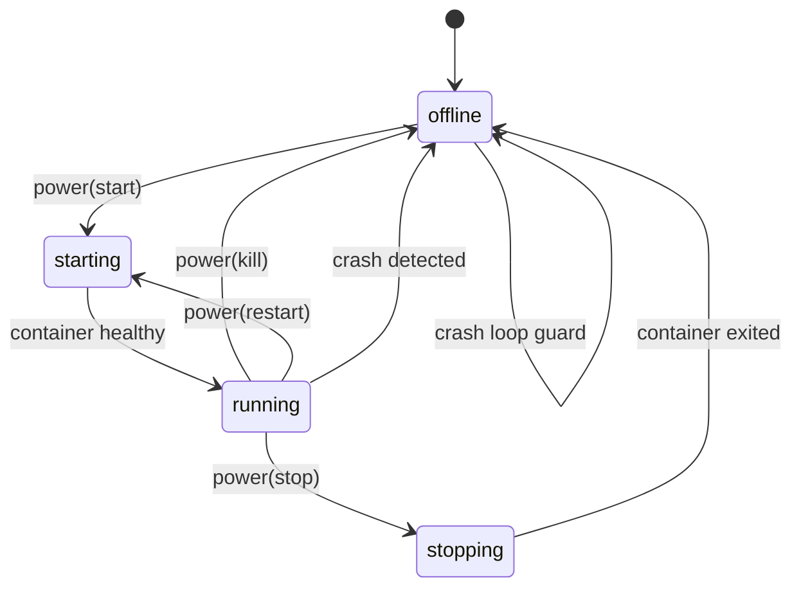
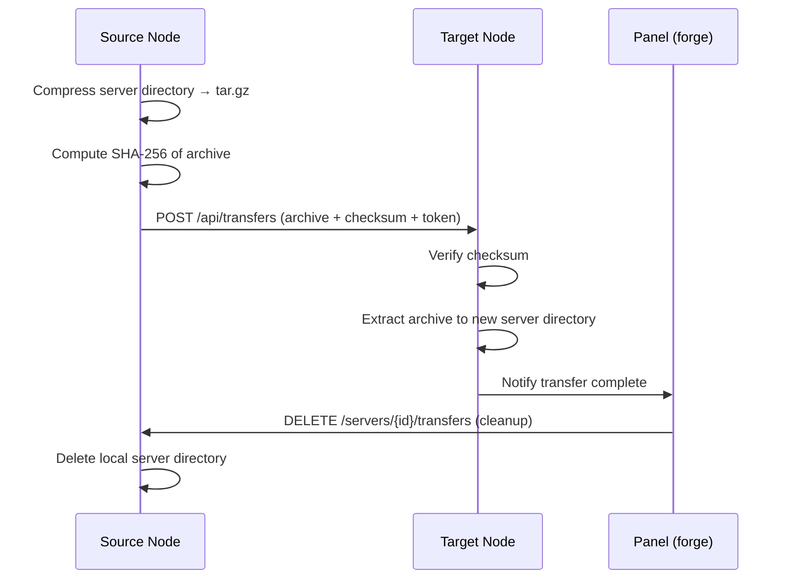

# 05 — Daemon Analysis (`beacon`)

## Compilation Status

> **CRITICAL — beacon will not compile.**

`beacon/internal/backup/local.go` imports `golang.org/x/sync/errgroup`, which is absent from `beacon/go.mod`. This is a hard compilation error that must be resolved before any other work on the daemon. Fix: add `golang.org/x/sync` to `beacon/go.mod` and run `go mod tidy`.

---

## Complete HTTP Route Table

41 registered routes:

| Method | Path | Status | Notes |
|---|---|---|---|
| GET | `/health` | ✅ | Public — liveness probe |
| GET | `/metrics` | ✅ | Public — Prometheus metrics |
| GET | `/api/system` | ✅ | System info (CPU, RAM, OS) |
| POST | `/api/update` | ⚠️ | Stub — body parsed, config write skipped |
| POST | `/api/deauthorize-user` | ✅ | Revokes user session token |
| POST | `/servers` | ✅ | Create server + Docker volume |
| DELETE | `/servers/{id}` | ⚠️ | Deletes server record; Docker volume NOT deleted |
| GET | `/servers/{id}/configuration` | ✅ | Returns server config JSON |
| PUT | `/servers/{id}/configuration` | ✅ | Updates server config |
| POST | `/servers/{id}/install` | ✅ | Runs install script in container |
| GET | `/servers/{id}/install/ws` | ⚠️ | Batches all install logs; sends after completion, not in real-time |
| POST | `/servers/{id}/reinstall` | ⚠️ | Re-runs install script; does NOT clear existing server files first |
| POST | `/servers/{id}/power` | ✅ | start / stop / kill / restart signals |
| GET | `/servers/{id}/stats` | ✅ | One-shot CPU/RAM/disk snapshot |
| GET | `/servers/{id}/logs` | ✅ | Returns last N log lines |
| POST | `/servers/{id}/backups` | ✅ | Creates local zip backup |
| GET | `/servers/{id}/backups` | ✅ | Lists backups |
| GET | `/servers/{id}/backups/download` | ✅ | Streams backup archive |
| POST | `/servers/{id}/backups/restore` | ✅ | Extracts backup into server directory |
| DELETE | `/servers/{id}/backups/{backupId}` | ❌ | Handler written but **not registered** in router |
| GET | `/servers/{id}/ws/stats` | ⚠️ | Polling every 2s — not true streaming |
| GET | `/servers/{id}/ws/logs` | ⚠️ | Polling every 3s — re-fetches last 5 min of history each tick |
| GET | `/servers/{id}/ws/console` | ✅ | Real-time bidirectional — attaches to Docker log stream |
| GET | `/servers/{id}/files/list` | ✅ | Directory listing |
| DELETE | `/servers/{id}/files/delete` | ✅ | Single file/directory delete |
| POST | `/servers/{id}/files/mkdir` | ✅ | Create directory |
| PUT | `/servers/{id}/files/rename` | ✅ | Rename / move single file |
| POST | `/servers/{id}/files/archive` | ✅ | Compress selection to zip/tar |
| POST | `/servers/{id}/files/decompress` | ✅ | Extract archive |
| POST | `/servers/{id}/files/delete-batch` | ✅ | Bulk delete |
| POST | `/servers/{id}/files/rename-batch` | ✅ | Bulk rename |
| POST | `/servers/{id}/files/chmod` | ✅ | Change file permissions |
| POST | `/servers/{id}/files/copy` | ⚠️ | Files only — silently fails on directories |
| POST | `/servers/{id}/files/pull` | ⚠️ | No SSRF protection, no timeout, no size limit |
| GET | `/servers/{id}/files/content` | ✅ | Read file contents |
| PUT | `/servers/{id}/files/content` | ✅ | Write file contents |
| POST | `/servers/{id}/files/upload` | ✅ | Multipart file upload |
| POST | `/servers/{id}/command` | ✅ | Send command to server stdin |
| POST | `/servers/{id}/transfers` | ✅ | Initiate outgoing transfer |
| GET | `/servers/{id}/transfers` | ✅ | Get transfer status |
| DELETE | `/servers/{id}/transfers` | ✅ | Cancel outgoing transfer |
| POST | `/api/transfers` | ✅ | Receive incoming transfer from another node |

---

## Server State Machine

---

## Docker Integration Depth

### Operations

| Operation | Supported | Notes |
|---|---|---|
| Create container | ✅ | On server create / install |
| Install (run script) | ✅ | Ephemeral install container |
| Start | ✅ | `ContainerStart` |
| Stop | ✅ | `ContainerStop` with grace period |
| Kill | ✅ | `ContainerKill` SIGKILL |
| Restart | ✅ | Stop → Start |
| Stats (one-shot) | ✅ | `ContainerStats` single read |
| Stats (streaming) | ⚠️ | Polled every 2s — stream not held open |
| Logs | ✅ | `ContainerLogs` tail |
| Console attach | ✅ | `ContainerLogs` follow=true piped to WS |
| Delete container | ✅ | On server delete |
| Delete volume | ❌ | Volume left behind on server delete |
| docker exec | ❌ | Not implemented |
| Image management | ❌ | Images never pulled/deleted by daemon |
| Network management | ❌ | Uses default bridge only |

### Container Security Profile

| Setting | Value |
|---|---|
| User | `998:998` |
| CapDrop | `ALL` |
| Privileged | `false` |
| ReadonlyRootfs | `true` |
| no-new-privileges | `true` |
| Tmpfs | `/tmp` — 64 MiB |
| NetworkMode | `bridge` |
| PidsLimit | `256` |
| Log driver | `json-file` |

### Gaps vs Wings (Pterodactyl daemon)

- No `docker exec` — interactive shell into running container not possible
- Docker volume not deleted on server delete → unbounded storage leak
- Image management absent — images must be pre-pulled on the host
- Stats are one-shot poll (2s), not a held streaming connection
- `heartbeatMb` reads Go heap (`runtime.MemStats.HeapAlloc`) rather than system RAM — values shown on the panel dashboard do not reflect actual host memory pressure

---

## SFTP Server Status

| Feature | Status | Notes |
|---|---|---|
| SSH server with Ed25519 host key | ✅ | Generated on first start |
| Panel-delegated authentication | ✅ | Validates token against panel API |
| Read (download) | ✅ | |
| Write (upload) | ✅ | |
| Mkdir | ✅ | |
| Delete | ✅ | |
| Rename / move | ✅ | |
| Permission enforcement (5 flags) | ✅ | read/write/create/delete/archive |
| Path traversal prevention | ✅ | All paths clamped to server root |
| Disk quota enforcement | ❌ | Writes not checked against disk limit |
| `.pteroignore` filtering | ❌ | All files visible via SFTP |
| Session registry | ❌ | No tracking of active SFTP sessions |
| Symlink resolution | ❌ | Symlinks not followed or blocked consistently |

---

## File Management Capabilities

| Operation | Supported | Notes |
|---|---|---|
| List directory | ✅ | Recursive flag supported |
| Read file content | ✅ | |
| Write file content | ✅ | |
| Upload (multipart) | ✅ | |
| Create directory | ✅ | |
| Delete (single) | ✅ | |
| Delete (batch) | ✅ | |
| Rename / move (single) | ✅ | |
| Rename / move (batch) | ✅ | |
| Copy file | ⚠️ | Files only — directories not handled |
| Compress to archive | ✅ | zip and tar.gz |
| Decompress archive | ✅ | |
| Change permissions (chmod) | ✅ | |
| Pull remote URL | ⚠️ | No SSRF protection, no timeout, no size limit |

---

## Backup System

| Capability | Local | S3 |
|---|---|---|
| Create zip archive | ✅ | ❌ S3 client field is commented out; silently falls back to local |
| List backups | ✅ | ❌ |
| Download backup | ✅ | ❌ |
| Restore from backup | ✅ | ❌ |
| Delete backup | ✅ | ❌ |
| SHA-256 checksum | ✅ | ❌ |
| Panel completion notification | ❌ | ❌ `notifyPanelInstallStatus` is a stub |

**Additional gap:** the `DELETE /servers/{id}/backups/{backupId}` handler is fully implemented but was never registered in the router mux. Backup delete requests return 404.

---

## WebSocket Implementation

| Channel | Type | Status | Notes |
|---|---|---|---|
| Console | `/servers/{id}/ws/console` | ✅ | Real-time — tails Docker log stream directly |
| Stats | `/servers/{id}/ws/stats` | ⚠️ | Polling — one `ContainerStats` call per 2s tick |
| Logs | `/servers/{id}/ws/logs` | ⚠️ | Polling — re-fetches last 5 min of history every 3s |
| Install progress | `/servers/{id}/install/ws` | ⚠️ | Batch — all logs sent in one message after install completes |

---

## Transfer System

> **Security note:** The transfer authentication token is the global node token shared by all transfers on that node. There is no per-transfer token isolation — a leaked token can be replayed to inject arbitrary archives.

---

## Panel Communication Gaps

| Method | Defined | Called | Notes |
|---|---|---|---|
| `SendNodeHeartbeat` | ✅ | ✅ | Every 30s — CPU, RAM (Go heap), uptime |
| `SendActivityLogs` | ✅ | ❌ | Defined in remote client, never invoked |
| `SendServerStats` | ✅ | ❌ | Defined in remote client, never invoked |
| `notifyPanelInstallStatus` | ✅ | ⚠️ | Called by installer, but body is a stub — just logs locally |
| Placement / evacuation callbacks | ✅ | ❌ | Methods exist; never called from any code path |

---

## Critical Bugs

### 🔴 Blocker — Will not compile or data-loss risk

1. 🔴 **Missing `golang.org/x/sync` in `go.mod`** — `beacon/internal/backup/local.go` imports `errgroup`; the module is absent. Daemon will not build.
2. 🔴 **`deleteBackup` handler not registered in mux** — `DELETE /servers/{id}/backups/{backupId}` is silently unreachable; backup deletion always returns 404.
3. 🔴 **S3 client never initialized** — The S3 struct field is commented out. All S3 backup operations fail silently and fall back to local storage without any error to the caller.
4. 🔴 **`notifyPanelInstallStatus` is a stub** — After a server install completes, the panel is never notified. The panel shows the server as permanently "installing".

### 🟡 High — Incorrect behavior

5. 🟡 **`syncEnvironmentFromPanel` stub** — Startup variables fetched from the panel are discarded; containers always start with the default environment.
6. 🟡 **`postUpdate` stub** — Configuration pushes from the panel are silently ignored; the daemon never updates its config at runtime.
7. 🟡 **Stats and logs WebSocket use polling, not streaming** — Stats poll every 2s and logs poll every 3s. Each tick opens a new Docker API call, causing unnecessary overhead. Docker's streaming APIs exist and should be used.
8. 🟡 **Install WebSocket batches output** — No real-time install progress is delivered to the client; all log lines arrive in a single message after the container exits.
9. 🟡 **`heartbeatMb` uses Go heap, not system RAM** — `runtime.MemStats.HeapAlloc` reflects Go garbage collector state, not total host memory consumption. Dashboard RAM figures are misleading.
10. 🟡 **No TLS** — All panel ↔ daemon traffic is unencrypted. A network-adjacent attacker can read tokens and commands in plaintext.
11. 🟡 **No per-server WebSocket authentication** — Any client holding a valid node token can attach the console of any server on that node.
12. 🟡 **`pullRemoteFile` has no SSRF protection** — The daemon will make HTTP requests to any URL the user provides, including internal addresses (`169.254.x.x`, `10.x.x.x`, etc.).
13. 🟡 **`pullRemoteFile` has no timeout or size limit** — A slow or infinite response body will hold a goroutine open indefinitely and can exhaust disk space.

### 🟠 Medium — Functional gaps

14. 🟠 **`copyFile` does not handle directories** — Copying a directory silently fails or produces a partial result.
15. 🟠 **`reinstall` does not clear server files** — Re-running the install script layers on top of existing files rather than starting clean.
16. 🟠 **Docker volumes not deleted on server delete** — Each deleted server leaves a dangling volume; disk usage grows unboundedly.
17. 🟠 **Transfer uses global node token** — No per-transfer authentication. A single token compromise allows arbitrary archive injection from any source.
18. 🟠 **`AtomicBool.SwapIf` is not a true CAS** — The check-then-swap is implemented as two separate atomic operations, leaving a race window between them.
19. 🟠 **`Locker.TryAcquire` goroutine leak** — If the context is cancelled while waiting for a lock, the waiting goroutine is not cleaned up and leaks.
20. 🟠 **`events.Bus` and `system/` packages are dead code** — Both packages are defined but never imported anywhere in the daemon. They can be removed.
