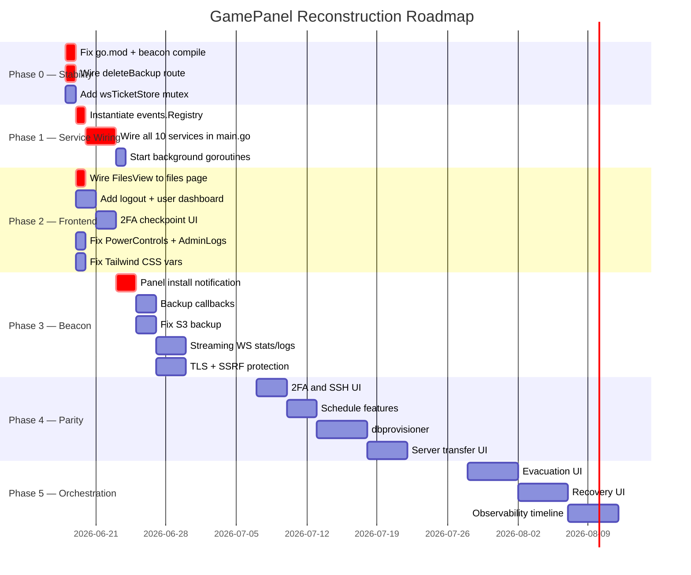

# 11 — Prioritized Reconstruction Roadmap

## Phase 0 — Compilation & Runtime Stability (Days 1–2)

These must be completed before anything else works. Each item is under 1 hour.

| # | Task | File | Change | Time |
|---|---|---|---|---|
| 1 | Fix beacon `go.mod` — add `golang.org/x/sync` | `beacon/go.mod` | `go get golang.org/x/sync` | 5 min |
| 2 | Register `deleteBackup` route in HTTP mux | `beacon/internal/server/server.go` | Add `DELETE` route | 10 min |
| 3 | Add mutex to `wsTicketStore` | `forge/api/internal/http/handlers_ws_ticket.go` | Add `sync.RWMutex` | 15 min |
| 4 | Read `PLUGINS_DIR` env var in `main.go` | `forge/api/cmd/api/main.go` | `os.Getenv("PLUGINS_DIR")` | 5 min |

---

## Phase 1 — Wire the Service Graph (Days 2–4)

The most impactful single change. Instantiates all 10 services and wires the event bus. Services must be instantiated in dependency order:

1. `events.Registry` — no deps
2. `runtime.Registry` — no deps
3. `scheduler.Scheduler` — store
4. `reservations.Manager` — store, events
5. `clustermanager.Service` — store, runtime, scheduler, reservations, events
6. `heartbeatmonitor.Service` — store, events
7. `reconciler.Service` — store, clusterManager, events
8. `evacuationplanner.Service` — store, scheduler, events
9. `migration.Service` — store, reservations, events
10. `recovery.Coordinator` — store, scheduler, reservations, migration, events
11. `observability.Service` — store, events → subscribe to events registry

Then start background goroutines:
- `heartbeatMonitor.Start(ctx)`
- `reconciler.Start(ctx)`
- `reservations.Manager.Start(ctx)`
- `observability.Subscribe(eventRegistry)`

**Expected outcome:** Server creation, power control, and deletion all become functional. All orchestration routes stop panicking.

---

## Phase 2 — Frontend Core Fixes (Days 3–5, parallel with Phase 1)

| # | Task | File | Fix |
|---|---|---|---|
| 1 | Wire `FilesView` to files page | `app/server/[id]/files/page.tsx` | Change import from `FileManager` to `FilesView` |
| 2 | Add logout button | `admin-shell.tsx` + `server-nav.tsx` | Call `logout()` + redirect to `/` |
| 3 | Add `/servers` user dashboard | `app/servers/page.tsx` | New page listing `fetchServers()` |
| 4 | Add 2FA login checkpoint UI | `app/page.tsx` | Conditional render checkpoint form when token required |
| 5 | Fix `PowerControls` | `components/server/power-controls.tsx` | Use `sendPowerSignal()` from `api.ts` |
| 6 | Fix `AdminLogs` endpoint | `components/admin/AdminLogs.tsx` | Call correct log endpoint |
| 7 | Pass `node` prop to `ServerSettingsView` | `components/server/server-console-layout.tsx` | Add `node` to props |
| 8 | Fix Tailwind CSS variables | `tailwind.config.ts` | Define `panel-brand`, `panel-ink`, `panel-line`, `panel-muted` |

---

## Phase 3 — Beacon Reliability (Week 2)

| # | Task | Priority |
|---|---|---|
| 1 | Implement `notifyPanelInstallStatus` — POST install completion to panel API | P0 |
| 2 | Implement `sendActivityLogs` calls after file/power operations | P1 |
| 3 | Implement `sendBackupCompletion` after backup creation | P1 |
| 4 | Fix S3 backup — initialize client from env vars (`S3_ENDPOINT`, `S3_BUCKET`, etc.) | P1 |
| 5 | Switch `statsWS` to `ContainerStats` streaming mode (not one-shot polling) | P1 |
| 6 | Switch `logsWS` to Docker log streaming with `follow=true` | P1 |
| 7 | Add real-time install log streaming via `installWS` | P1 |
| 8 | Add TLS support via cert/key path env vars | P1 |
| 9 | Add SSRF protection to `pullRemoteFile` | P1 |
| 10 | Add per-server WebSocket authorization check | P1 |
| 11 | Implement `syncEnvironmentFromPanel` to fetch startup variables pre-start | P2 |
| 12 | Implement `postUpdate` config reload | P2 |
| 13 | Fix `heartbeat` `memoryMb` to report system RAM, not Go heap | P2 |
| 14 | Implement server state persistence (`states.json` save/restore) | P1 |

---

## Phase 4 — Feature Parity (Weeks 3–5)

| Feature | Description | Effort |
|---|---|---|
| 2FA setup/management UI | Account page with TOTP QR code flow | Medium |
| SSH key management UI | List/add/remove keys | Small |
| Schedule command task support | Implement the errored-stub task type | Medium |
| Schedule `only_when_online` field | Skip run if server is offline | Small |
| Schedule `continue_on_failure` per task | Control task chaining on error | Small |
| Backup `is_locked` field | Prevent deletion of locked backups | Small |
| `dbprovisioner` — actual database provisioning | Wire MySQL/Postgres create/drop | Large |
| Docker volume cleanup on server delete | Remove named volumes on teardown | Small |
| SFTP disk quota enforcement | Check quota before writes | Medium |
| SFTP session cancellation via deauthorize | Kill active sessions on token revoke | Small |
| Mail SMTP backend | Replace stub with real SMTP sender | Medium |
| Server transfer UI | Initiate and track node-to-node transfer | Medium |
| Regions admin management UI | CRUD for regions | Medium |

---

## Phase 5 — Advanced Orchestration (Weeks 6–10)

Once Phase 1 wires the services, these become integration and UI work rather than foundational engineering.

| Feature | Effort |
|---|---|
| Evacuation planner end-to-end testing and UI | Large |
| Recovery coordinator activation and UI | Large |
| Migration engine UI (view/cancel migrations) | Medium |
| Observability timeline UI | Large |
| Redis realtime pub/sub fanout (`realtime/` package) | Large |
| Multiple Docker images per egg (label→image map) | Medium |
| Egg import/export PTDL_v2 format | Medium |

---

## Gantt Overview

