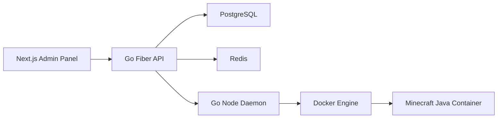

# Architecture

## Goal

Build a modern, low-memory game panel prototype with a polished admin dashboard, a Go panel API, and a Go daemon that controls Docker-backed game servers.

## System Shape

## Boundaries

- The frontend never touches the host filesystem or Docker directly.
- The panel API owns identity, RBAC, audit logs, server records, node records, and orchestration intent.
- The daemon owns host-local actions: container lifecycle, stats, logs, and jailed file access.
- Redis is used from the start for rate-limit readiness and realtime/event fanout.
- Python services are optional and must not sit on the critical path for realtime container control.

## Runtime Strategy

Docker Engine API is the first runtime because it is easiest to debug, test, and explain. The daemon keeps a small runtime interface so later support for containerd or Podman does not rewrite panel behavior.

## Production Hardening

Server-scoped API access is enforced through granular Pterodactyl-style permissions. Admin users bypass checks, server owners bypass checks for their own servers, and subusers are authorized against the permissions stored for that server. Server lists are filtered to the current user's owned and subuser-accessible servers.

The daemon keeps a `ServerManager` in front of the runtime. It stores per-server state in memory, including power state, install state, startup state, running action, root directory, disk limit, configuration sync status, expected stop, crash cooldown, and last crash time. Power actions use a per-server lock and fail fast when another action is running, which prevents overlapping start, stop, restart, and kill requests.

Before start or restart reaches the runtime, the manager runs a local `onBeforeStart` preflight. The API remains responsible for user permission validation before calling the daemon. The daemon validates install state, requires synced server configuration, and checks current disk usage against the configured disk limit. Unlimited disk limits still trigger a best-effort usage calculation without blocking startup.

Docker-backed runtimes may implement event watching. The Docker runtime listens for labeled container exit events and passes them to the `ServerManager`; unexpected non-zero exits or OOM exits trigger automatic restart when crash detection is enabled and the server is outside its cooldown window. Expected stops and clean exits are marked offline without restart.

Database migrations are tracked in `schema_migrations`, so startup only applies pending SQL files and records each version after its migration transaction succeeds. The API schedule runner uses PostgreSQL `LISTEN/NOTIFY` for schedule/task changes, a timer for the nearest due `next_run_at`, and minute polling as a fallback. Realtime WebSocket proxy pumps share one cancellation context and close both sockets when either side exits.

## AI Development Rule

When adding features, update `docs/api.md`, `docs/daemon.md`, and `docs/security.md` before or alongside code changes. These docs are the coordination layer for multiple coding agents.
