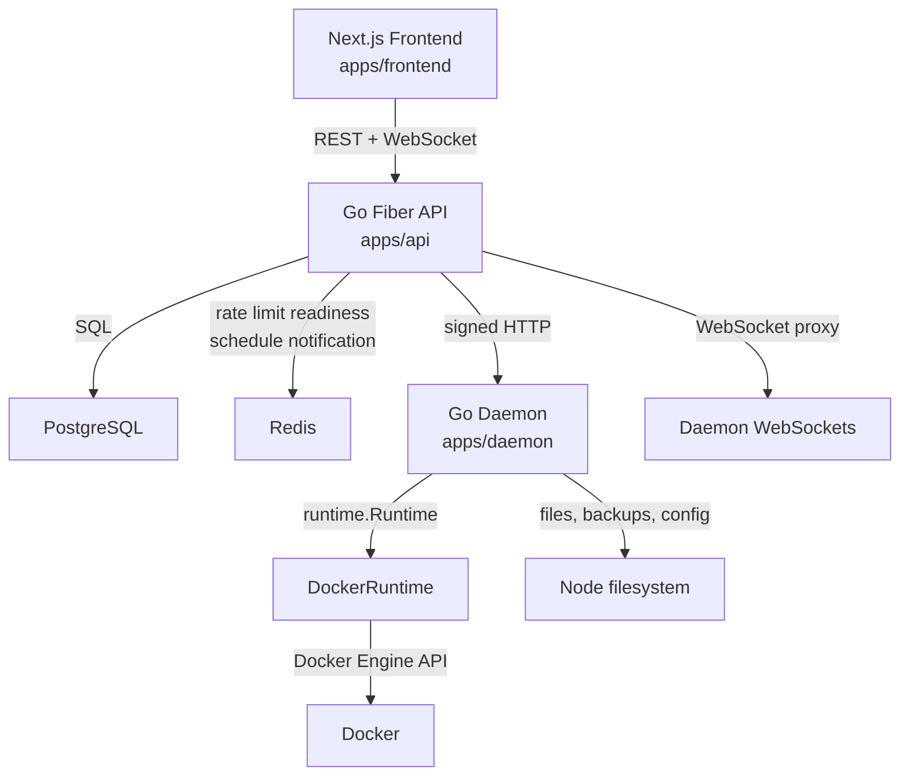
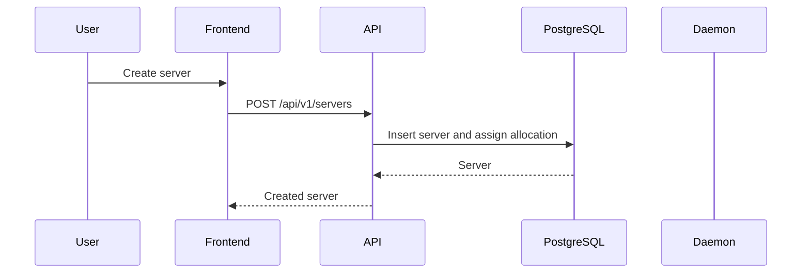
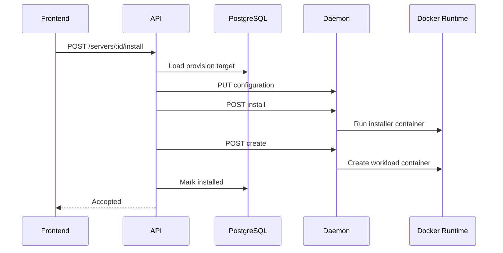
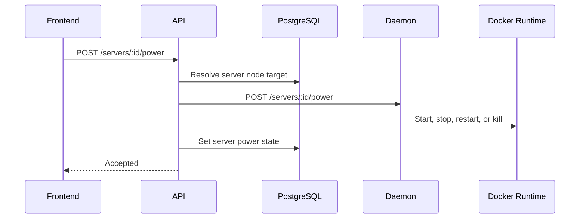

# Current Architecture

## Summary

GamePanel currently uses a three-application monorepo:

- `apps/frontend`: Next.js frontend.
- `apps/api`: Go Fiber API.
- `apps/daemon`: Go node daemon.

The current runtime path is Docker-first:

```text
Frontend -> API -> Daemon -> Docker
```

The code already contains early abstractions for nodes, daemon communication, runtime, schedules, audit logs, permissions, backups, mounts, databases, and Pterodactyl-style concepts. The next stage is to turn those early abstractions into platform boundaries.

## Existing System Diagram



## Frontend

Location: `apps/frontend`

Responsibilities:

- Admin dashboard.
- Server dashboard.
- Auth flow.
- Node, server, allocation, template, schedule, backup, file, database, startup, user, and activity UI.
- REST calls and WebSocket URL construction through `apps/frontend/lib/api.ts`.

Current constraints:

- Frontend talks to `/api/v1`.
- Frontend keeps hand-written API types.
- Frontend still has legacy mock data in `apps/frontend/lib/mock-data.ts`, although real API mode is the intended path.

## API

Location: `apps/api`

Responsibilities:

- HTTP API Gateway.
- Auth and JWT sessions.
- RBAC and server permissions.
- PostgreSQL migrations and store access.
- Node CRUD and heartbeat endpoint.
- Server CRUD and lifecycle endpoints.
- Allocation management.
- Schedule runner.
- Daemon client.
- Audit and activity.
- Realtime WebSocket proxy.

Current constraints:

- API handlers contain orchestration logic that should eventually move to cluster manager and scheduler services.
- Schedule execution runs inside the API process.
- API directly calls daemon node URLs.
- API sets some server status optimistically after daemon commands.

## Daemon

Location: `apps/daemon`

Responsibilities:

- Host-local workload lifecycle actions.
- Install scripts.
- Stats, logs, console WebSockets.
- File operations.
- Backup create, list, download, and restore.
- Local server state manager.
- Docker event watcher.
- Heartbeat to panel API.
- Remote server configuration sync.
- Optional native SFTP service.

Current constraints:

- Daemon starts Docker runtime directly.
- Daemon reports `dockerStatus`.
- Daemon stores server manager state in memory.
- Daemon HTTP handlers contain transport, filesystem, runtime, backup, and config logic in a large server file.

## Contracts

Location: `packages/contracts`

Current state:

- Contains `openapi.yaml`.
- OpenAPI is incomplete compared to implemented API behavior.
- Frontend TypeScript types are handwritten.
- API and daemon request/response structs are duplicated between packages.

Needed direction:

- Shared API contracts.
- Shared daemon-agent protocol contracts.
- Shared event schemas.
- Shared runtime-neutral resource models.

## Runtime

Location: `apps/daemon/internal/runtime`

Current state:

- `Runtime` interface exists.
- Docker implementation exists.
- Docker stats decoder exists.
- Docker event watcher exists.

Current Docker coupling:

- Docker image terminology.
- Docker Engine API client.
- Docker labels.
- Docker events.
- Docker volumes.
- Docker bridge networking.
- CPU shares.
- `dockerStatus` node heartbeat field.

## Data Flow

### Create Server



### Install Server



### Power Server



