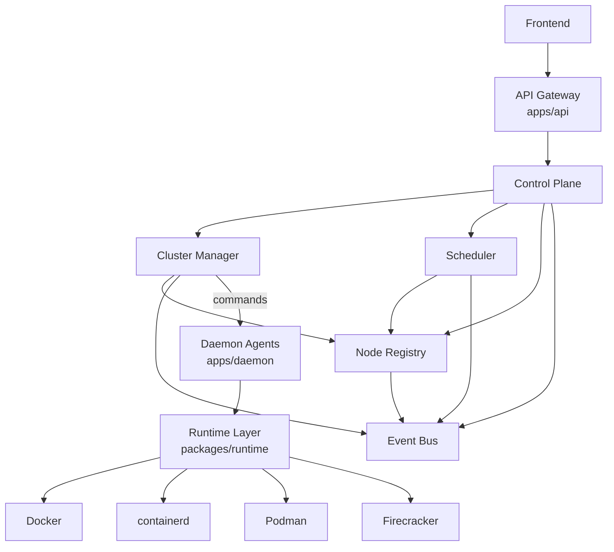

# Target Architecture

## Current State

The current system is functional but tightly shaped around this path:

```text
Frontend -> API -> Daemon -> Docker
```

This is a good MVP path, but it is not enough for long-term orchestration.

Current limitations:

- API handlers contain orchestration decisions.
- Daemon nodes are directly addressed by API request handlers.
- Scheduling is embedded inside API.
- Events are not durable platform primitives.
- Runtime abstraction exists but still exposes Docker-shaped concepts.
- Nodes are partially modeled but not yet full infrastructure resources.

## Future State

The target system separates gateway, control plane, orchestration, scheduling, eventing, node state, agents, and runtime providers.



## Control Plane

The Control Plane owns desired state and platform policy.

Responsibilities:

- Accept workload intent from API Gateway.
- Persist desired state.
- Coordinate cluster manager, scheduler, node registry, and event bus.
- Maintain compatibility with existing API behavior.
- Keep domain logic out of HTTP handlers.

Interfaces:

- `CreateWorkload`
- `InstallWorkload`
- `StartWorkload`
- `StopWorkload`
- `DeleteWorkload`
- `TransferWorkload`
- `GetWorkloadState`

## Cluster Manager

The Cluster Manager owns lifecycle orchestration.

Responsibilities:

- Convert desired state into daemon-agent commands.
- Reconcile actual state with desired state.
- Coordinate installation, creation, power, deletion, transfer, and future failover.
- Publish lifecycle events.

Boundary:

- It may talk to daemon agents.
- It should not expose daemon URLs to frontend.
- It should not make placement decisions directly. Placement belongs to scheduler.

## Scheduler

The Scheduler owns placement.

Responsibilities:

- Filter unhealthy or incompatible nodes.
- Score nodes by region, CPU, RAM, disk, allocation availability, labels, taints, and policy.
- Return explainable placement decisions.
- Support manual node override during migration.
- Support predictive placement later.

Output:

- `PlacementDecision`
- selected node
- selected allocation candidates
- score
- reasons
- alternatives

## Node Registry

The Node Registry owns node identity, health, capacity, and allocation inventory.

Responsibilities:

- Store nodes as first-class infrastructure resources.
- Track node health from daemon heartbeats.
- Track runtime capabilities.
- Track allocatable and allocated capacity.
- Provide scheduler-ready snapshots.

Boundary:

- Nodes are not customer-facing inventory.
- Regions are customer-facing inventory.

## Event Bus

The Event Bus owns durable platform events.

Responsibilities:

- Publish lifecycle, backup, node, scheduler, and runtime events.
- Decouple API requests from background work.
- Support future workflows such as billing, monitoring, audit expansion, AI operations, and failover.

Initial event types:

- `ServerCreated`
- `ServerStarted`
- `ServerStopped`
- `ServerDeleted`
- `BackupCreated`
- `NodeOnline`
- `NodeOffline`

## Runtime Layer

The Runtime Layer owns provider-neutral workload execution.

Responsibilities:

- Hide Docker, containerd, Podman, Firecracker, and future runtimes.
- Normalize lifecycle operations.
- Normalize resource limits, stats, logs, console sessions, and runtime events.
- Expose provider capabilities.

Runtime providers:

- Docker
- containerd
- Podman
- Firecracker

## Modular Architecture

Target folder structure:

```text
apps/
  api/
  daemon/
  frontend/

services/
  cluster-manager/
  scheduler/
  eventbus/

packages/
  contracts/
  runtime/
  events/
  telemetry/
```

Services may begin as internal packages before becoming separately deployable processes. The folder structure is a direction, not a requirement to prematurely split deployments.

