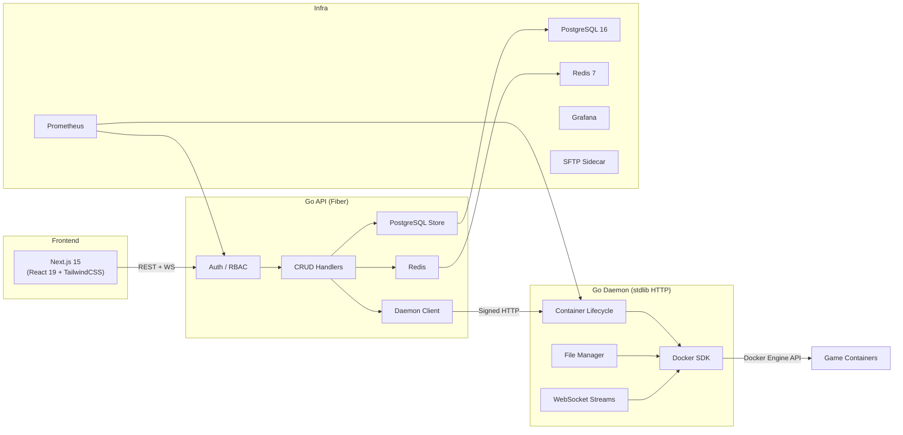
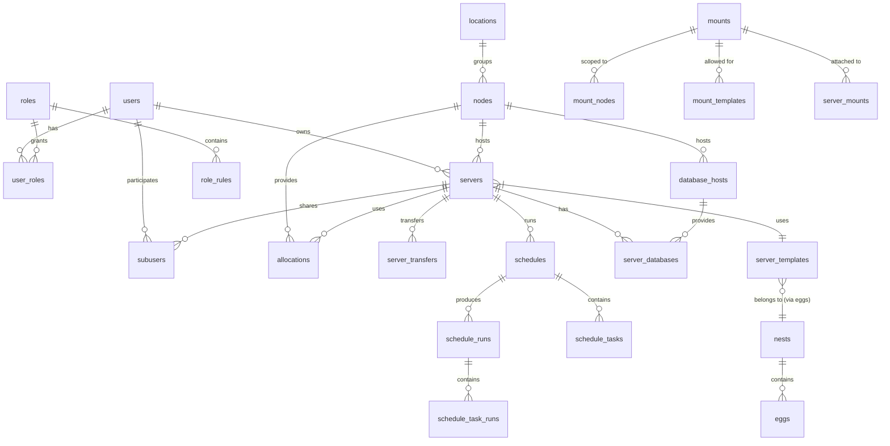

# Modern Game Panel — Full Project Analysis

## 1. Executive Summary

**Modern Game Panel** is a **Pterodactyl-inspired** open-source game hosting panel prototype, rebuilt from scratch in a modern stack. It is a **monorepo** containing three backend/frontend services plus infrastructure scaffolding, targeting low memory usage, realtime workflows, and Docker-backed game server management.

| Metric | Value |
|---|---|
| Source files (Go, TS/TSX, SQL, YAML) | **~3,941 files** |
| Total source size | **~22.6 MB** |
| Database migrations | **16 sequential SQL files** |
| Frontend API client functions | **~60 exported functions** |
| Daemon endpoints | **20 HTTP routes** |
| API handler file | **2,652 lines** (single file) |
| Store/DB layer | **3,262 lines** (single file) |
| Dashboard component | **162 KB / ~2,261+ lines** (single file) |
| Roadmap phases completed | **7 of 7** ✅ |

> [!IMPORTANT]
> The project is **functionally complete for its MVP scope**, with all 7 roadmap phases marked done. The primary challenge now is **code quality, modularity, and production hardening** — not feature gaps.

---

## 2. Architecture Overview



### Data Flow Boundaries (Correctly Enforced)
1. **Frontend → API only** — frontend never touches host FS or Docker
2. **API → Daemon via signed HTTP** — HMAC-SHA256 with timestamps (5-min clock skew)
3. **Daemon → Docker Engine** — container lifecycle, stats, logs, console attach
4. **Daemon → Jailed FS** — all file ops path-sanitized to server data directory

---

## 3. Tech Stack Deep Dive

### Frontend (`apps/frontend`)

| Layer | Tech | Version |
|---|---|---|
| Framework | Next.js (App Router) | 15.3+ |
| UI Library | React | 19.0 |
| Language | TypeScript | 5.7 |
| Styling | TailwindCSS | 3.4 |
| State | Zustand | 5.0 |
| Data Fetching | TanStack Query | 5.90 |
| Code Editor | Monaco Editor | 0.55 |
| Icons | Lucide React | 0.468 |
| Utils | clsx, tailwind-merge | — |

**Key files:**
- [api.ts](file:///e:/game/apps/frontend/lib/api.ts) — 1,104 lines, ~60 API functions, typed responses
- [dashboard.tsx](file:///e:/game/apps/frontend/components/dashboard.tsx) — **162 KB monolith** containing the entire admin + server UI
- [mock-data.ts](file:///e:/game/apps/frontend/lib/mock-data.ts) — demo fallback data, gated by `NEXT_PUBLIC_DEMO_MODE`

### API (`apps/api`)

| Layer | Tech |
|---|---|
| Language | Go 1.25 |
| HTTP Framework | Fiber v2.52 |
| Database Driver | pgx v5 (connection pool) |
| Cache | go-redis v9 |
| Auth | Custom HMAC-SHA256 JWT-like tokens |
| WebSocket | Fiber WebSocket contrib + gorilla/websocket |
| Password Hashing | bcrypt |

**Key files:**
- [main.go](file:///e:/game/apps/api/cmd/api/main.go) — 115 lines, clean startup with DB connect, Redis, healthcheck mode
- [server.go](file:///e:/game/apps/api/internal/http/server.go) — **2,652 lines monolith**, ALL routes in one file
- [store.go](file:///e:/game/apps/api/internal/store/store.go) — **3,262 lines**, entire PostgreSQL data access layer
- [client.go](file:///e:/game/apps/api/internal/daemon/client.go) — 585 lines, daemon HTTP client with HMAC signing
- [auth.go](file:///e:/game/apps/api/internal/http/auth.go) — 121 lines, token issuance/validation/middleware

### Daemon (`apps/daemon`)

| Layer | Tech |
|---|---|
| Language | Go 1.25 |
| HTTP Server | stdlib `net/http` with `ServeMux` |
| Container Runtime | Docker Engine SDK v28 |
| WebSocket | gorilla/websocket |
| Runtime Abstraction | Interface-based (`runtime.Runtime`) |

**Key files:**
- [main.go](file:///e:/game/apps/daemon/cmd/daemon/main.go) — 231 lines, includes heartbeat loop + panel sync
- [server.go](file:///e:/game/apps/daemon/internal/server/server.go) — 1,160 lines, all 20 daemon HTTP handlers
- [runtime.go](file:///e:/game/apps/daemon/internal/runtime/runtime.go) — 73 lines, clean `Runtime` interface
- [docker.go](file:///e:/game/apps/daemon/internal/runtime/docker.go) — 274 lines, Docker SDK implementation

---

## 4. Database Schema (16 Migrations)



### Tables by Migration

| Migration | Tables Added |
|---|---|
| 001 | `users`, `nodes`, `server_templates`, `servers`, `allocations`, `audit_events` |
| 002-006 | Server fields: primary allocation, manage fields, transfer state/lifecycle, run token |
| 007 | **Core foundation**: `roles`, `role_rules`, `user_roles`, `locations`, `nests`, `eggs`, `subusers`, `server_transfers` |
| 008-009 | `schedules`, `schedule_tasks`, `schedule_runs`, `schedule_task_runs` |
| 010 | Node heartbeat fields |
| 011-012 | Wings-compatible node config: `daemon_token_id`, `daemon_token`, `daemon_base`, `scheme`, `fqdn`, etc. |
| 013 | `startup_variables`, `server_startup_values` |
| 014 | `database_hosts`, `server_databases` |
| 015 | `mounts`, `mount_nodes`, `mount_templates`, `server_mounts` |
| 016 | `subusers` panel parity with updated permissions column |

> [!NOTE]
> The migration runner is **naive** — it splits SQL on `;` and runs each statement. This works but lacks idempotency tracking (no `schema_migrations` table). Re-running is safe because all DDL uses `IF NOT EXISTS` / `ON CONFLICT DO NOTHING`.

---

## 5. API Surface Coverage

### Panel API Routes (~65 endpoints)

| Domain | Endpoints | Status |
|---|---|---|
| **Health / Metrics** | `/health`, `/metrics` | ✅ Implemented |
| **Auth** | `/auth/login`, `/auth/me` | ✅ Working |
| **Nodes** | CRUD + heartbeat + token rotate + config | ✅ Full CRUD |
| **Servers** | CRUD + power + install + suspend + transfer + toggle-install | ✅ Full lifecycle |
| **Allocations** | List, Create, Update, Delete, per-node, per-server, assign/unassign/primary | ✅ Comprehensive |
| **Templates** | List, Create | ✅ Basic |
| **Users** | List, Create | ✅ Basic |
| **Audit** | List events | ✅ Working |
| **Files** | List, Read, Write, Delete, Mkdir, Rename, Chunked Upload | ✅ Full |
| **Backups** | List, Create, Download | ✅ Working |
| **Schedules** | CRUD + tasks + runs + manual trigger | ✅ Full |
| **Databases** | Server DBs + Database Hosts CRUD | ✅ Working |
| **Mounts** | Admin CRUD + server assign/remove | ✅ Working |
| **Subusers** | Upsert, Update, Delete per server | ✅ Working |
| **Startup** | Get details, Update variables | ✅ Working |
| **Transfers** | Initiate, Cancel, Status, Success/Failure callbacks | ✅ Working |
| **Remote API** | Wings-compatible: servers list, reset, SFTP auth, install callbacks | ✅ Implemented |
| **WebSocket** | Stats, Logs, Console (proxied to daemon) | ✅ Implemented |

### Daemon Routes (20 endpoints)

| Route | Method | Status |
|---|---|---|
| `/health` | GET | ✅ |
| `/metrics` | GET | ✅ |
| `/servers` | POST | ✅ Create container |
| `/servers/{id}` | DELETE | ✅ Remove container |
| `/servers/{id}/configuration` | GET/PUT | ✅ Sync config |
| `/servers/{id}/install` | POST | ✅ Run install script |
| `/servers/{id}/power` | POST | ✅ Start/Stop/Restart/Kill |
| `/servers/{id}/stats` | GET | ✅ Docker stats |
| `/servers/{id}/logs` | GET | ✅ Container logs |
| `/servers/{id}/backups` | GET/POST | ✅ Zip-based backups |
| `/servers/{id}/backups/download` | GET | ✅ Download zip |
| `/servers/{id}/ws/stats` | GET | ✅ WebSocket stream |
| `/servers/{id}/ws/logs` | GET | ✅ WebSocket stream |
| `/servers/{id}/ws/console` | GET | ✅ Interactive attach |
| `/servers/{id}/files` | GET/DELETE | ✅ List/Delete |
| `/servers/{id}/files/content` | GET/PUT | ✅ Read/Write |
| `/servers/{id}/files/upload` | PUT | ✅ Chunked upload |
| `/servers/{id}/files/mkdir` | POST | ✅ Create directory |
| `/servers/{id}/files/rename` | PATCH | ✅ Rename |

---

## 6. Security Posture

### ✅ Strengths
- **Container isolation**: No privileged containers, capabilities dropped (`AUDIT_WRITE`, `MKNOD`, `NET_RAW`), memory/CPU limits enforced
- **File jailing**: Path traversal protection (`..`, absolute paths, symlinks, null bytes rejected)
- **Signed daemon requests**: HMAC-SHA256 with timestamps, 5-minute clock-skew window
- **Auth gating**: Production mode rejects default dev secrets
- **RBAC**: Role-based middleware (`requireRole("admin")`)
- **bcrypt passwords**: Proper hashing with default cost
- **Audit logging**: Most admin actions logged with actor + metadata

### ⚠️ Concerns
| Issue | Severity | Details |
|---|---|---|
| Custom JWT implementation | Medium | Hand-rolled HMAC-SHA256 token system instead of standard JWT library. No JTI, no refresh tokens. |
| No rate limiting on auth | Medium | Login endpoint has no brute-force protection (Redis is available but not used for this) |
| No CSRF protection | Low | Bearer tokens in localStorage mitigate this for the SPA, but cookie-based sessions would need CSRF |
| WebSocket auth via query param | Low | Token passed as `?token=` query parameter for WebSocket upgrades — logged in server access logs |
| SFTP sidecar not integrated | Medium | Uses static credentials (`game:gamepass`), not wired to panel auth |
| No TLS in development | Low | Expected for dev, but no automated TLS setup for production |
| 24-hour token TTL, no revocation | Low | No way to invalidate tokens before expiry |

---

## 7. Code Quality Analysis

### 🔴 Critical: Monolithic Files

The three largest files are severe maintainability bottlenecks:

| File | Lines | Size | Problem |
|---|---|---|---|
| [dashboard.tsx](file:///e:/game/apps/frontend/components/dashboard.tsx) | ~2,261+ | 162 KB | **Entire admin + server UI in one component** |
| [store.go](file:///e:/game/apps/api/internal/store/store.go) | 3,262 | 109 KB | **All database queries in one file** |
| [server.go](file:///e:/game/apps/api/internal/http/server.go) | 2,652 | 90 KB | **All API routes + handlers in one file** |

> [!CAUTION]
> These three files alone total **~360 KB of source code**. Any change to any route, query, or UI tab touches one of these files. This makes merge conflicts, code review, and bug isolation extremely difficult.

### 🟡 Moderate Concerns

1. **Demo fallback leaking**: Several API client functions (`fetchNodes`, `fetchServers`, `fetchAllocations`, etc.) catch errors and return mock data even when `DEMO_MODE` is false — the `demoFallback` function correctly throws, but the pattern is fragile
2. **No test coverage for frontend**: Zero test files in `apps/frontend`
3. **Minimal test coverage for backend**: Only `server_test.go` (4 KB) and `stats_test.go` (872 bytes) in the daemon; one `server_test.go` (4 KB) in the API
4. **Hardcoded resource defaults in API client**: `fetchNodes` patches `cpu: 42`, `memory: 58` fallback values; `fetchServers` generates fake memory/CPU strings

### 🟢 Strengths

1. **Clean runtime abstraction**: The `runtime.Runtime` interface is well-designed for future containerd/Podman support
2. **Proper Go project structure**: `cmd/` entrypoints, `internal/` packages, clean module boundaries
3. **Type-safe API client**: Frontend TypeScript types mirror backend Go structs
4. **Comprehensive migration chain**: 16 sequential migrations building up from basic to full schema
5. **Docker Compose health checks**: All services have proper health checks with retry logic
6. **Production hardening**: Demo mode gating, secret validation, environment-based configuration

---

## 8. Infrastructure

### Docker Compose Stack (7 services)

```
┌─────────────────────────────────────────────┐
│                docker-compose               │
├──────────┬──────────┬───────────┬───────────┤
│ postgres │  redis   │    api    │  daemon   │
│  :5432   │  :6379   │  :8080   │  :9090    │
├──────────┴──────────┼───────────┼───────────┤
│    prometheus       │  grafana  │   sftp    │
│     :9091           │  :3001    │  :2222    │
└─────────────────────┴───────────┴───────────┘
```

- **API healthcheck**: Binary self-calls `--healthcheck` mode
- **Daemon healthcheck**: Same pattern
- **Prometheus**: Scrapes `/metrics` from both API and daemon
- **Grafana**: Connected to Prometheus (manual dashboard setup needed)
- **SFTP**: `atmoz/sftp:alpine` with shared `game-servers` volume

### Shared Contract

[openapi.yaml](file:///e:/game/packages/contracts/openapi.yaml) — 490 lines, OpenAPI 3.1 spec covering the core Panel API surface. Used as documentation/coordination artifact, not for code generation.

---

## 9. Feature Completeness vs Pterodactyl

| Feature | Pterodactyl | This Project | Gap |
|---|---|---|---|
| Auth/Login + Session | ✅ | ✅ | — |
| Admin: Nodes CRUD | ✅ | ✅ | — |
| Admin: Allocations | ✅ | ✅ | — |
| Admin: Templates/Eggs | ✅ | ✅ (basic) | No egg variables editor UI |
| Admin: Users/Roles | ✅ | ✅ (basic) | No admin user management UI |
| Servers: Create → Install → Power | ✅ | ✅ | — |
| Console (WebSocket) | ✅ | ✅ | Server selection UX issue |
| Stats (WebSocket) | ✅ | ✅ | — |
| File Manager | ✅ | ✅ | — |
| Monaco Editor | ✅ | ✅ | — |
| Chunked Uploads | ✅ | ✅ | — |
| Backups | ✅ | ✅ (zip-based) | No S3/remote backup support |
| Schedules/Tasks | ✅ | ✅ | — |
| Server Databases | ✅ | ✅ | — |
| Mounts | ✅ | ✅ | — |
| Subusers | ✅ | ✅ (API) | UI stub only |
| Server Transfers | ✅ | ✅ | — |
| API Keys | ✅ | ❌ | Not implemented |
| SSH Keys | ✅ | ❌ | Not implemented |
| Two-Factor Auth | ✅ | ❌ | Not implemented |
| Activity Logs UI | ✅ | ❌ | Schema exists, no UI |

---

## 10. Recommendations (Prioritized)

### 🔴 High Priority — Code Health

1. **Split `dashboard.tsx`** (~162 KB) into ~15-20 focused components:
   - `AdminNodesView`, `AdminServersView`, `AdminUsersView`, `AdminAllocationsView`, `AdminTemplatesView`
   - `ServerConsoleView`, `ServerFilesView`, `ServerBackupsView`, `ServerNetworkView`, `ServerSchedulesView`, `ServerDatabasesView`, `ServerStartupView`, `ServerSettingsView`, `ServerUsersView`

2. **Split `server.go`** (API handlers, 2,652 lines) into domain-grouped handler files:
   - `handlers_auth.go`, `handlers_nodes.go`, `handlers_servers.go`, `handlers_allocations.go`, `handlers_files.go`, `handlers_backups.go`, `handlers_schedules.go`, `handlers_databases.go`, `handlers_mounts.go`, `handlers_subusers.go`, `handlers_remote.go`

3. **Split `store.go`** (3,262 lines) into domain-grouped query files:
   - `store_users.go`, `store_nodes.go`, `store_servers.go`, `store_allocations.go`, `store_templates.go`, `store_schedules.go`, `store_databases.go`, `store_mounts.go`, `store_subusers.go`, `store_audit.go`

### 🟡 Medium Priority — Reliability

4. **Add migration tracking table** — `CREATE TABLE IF NOT EXISTS schema_migrations (version TEXT PRIMARY KEY, applied_at TIMESTAMPTZ)` to prevent unnecessary re-execution

5. **Add proper test coverage** — at minimum:
   - API handler tests for auth, CRUD operations, RBAC
   - Store integration tests against a test database
   - Frontend component tests for critical flows

6. **Fix server selection UX** — The dashboard always targets `servers[0]`. Server detail pages (`/server/[id]/...`) exist as route stubs but aren't wired to the dashboard logic

7. **Remove hardcoded fallback values** — `fetchNodes` adding `cpu: 42`, `memory: 58` and similar patterns in `fetchServers` create misleading data

### 🟢 Lower Priority — Feature Completion

8. **Wire admin UI screens** — Users, Templates, and Allocations admin management screens are stubs
9. **Add rate limiting** — Redis is connected but not used for auth rate limiting
10. **Implement API keys** — For programmatic access
11. **Add activity logs UI** — Schema and audit trail exist; just needs a frontend view
12. **TLS/reverse proxy setup** — Nginx config exists as a scaffold but needs completion for production

---

## 11. File Structure Map

```
e:\game\
├── apps/
│   ├── api/                          # Go Fiber Panel API
│   │   ├── cmd/api/main.go           # Entrypoint (115 lines)
│   │   ├── internal/
│   │   │   ├── daemon/client.go      # Daemon HTTP client (585 lines)
│   │   │   ├── http/
│   │   │   │   ├── server.go         # ALL routes (2,652 lines) ⚠️
│   │   │   │   ├── auth.go           # Token + middleware (121 lines)
│   │   │   │   ├── realtime.go       # WS proxy (113 lines)
│   │   │   │   └── schedule_runner.go # Cron runner (186 lines)
│   │   │   ├── store/store.go        # ALL queries (3,262 lines) ⚠️
│   │   │   └── realtime/             # Placeholder
│   │   ├── migrations/               # 16 SQL files
│   │   ├── go.mod, go.sum, Dockerfile
│   │   └── .env.example
│   │
│   ├── daemon/                       # Go Node Daemon
│   │   ├── cmd/daemon/main.go        # Entrypoint + heartbeat (231 lines)
│   │   ├── internal/
│   │   │   ├── runtime/
│   │   │   │   ├── runtime.go        # Interface (73 lines)
│   │   │   │   ├── docker.go         # Docker impl (274 lines)
│   │   │   │   └── stats.go          # Stats decoder (52 lines)
│   │   │   └── server/
│   │   │       ├── server.go         # All handlers (1,160 lines)
│   │   │       └── server_test.go    # Tests (7 KB)
│   │   ├── go.mod, go.sum, Dockerfile
│   │   └── .env.example
│   │
│   ├── frontend/                     # Next.js Admin Panel
│   │   ├── app/
│   │   │   ├── layout.tsx, page.tsx, globals.css
│   │   │   ├── admin/ (nests, nodes, servers routes)
│   │   │   └── server/[id]/ (dynamic server route)
│   │   ├── components/
│   │   │   ├── dashboard.tsx         # Monolith (162 KB) ⚠️
│   │   │   ├── server-console.tsx    # Console component
│   │   │   ├── file-editor.tsx       # Monaco wrapper
│   │   │   ├── backups-panel.tsx     # Backup UI
│   │   │   ├── transfer-panel.tsx    # Transfer UI
│   │   │   └── pterodactyl/route-screen.tsx
│   │   ├── lib/
│   │   │   ├── api.ts                # API client (1,104 lines)
│   │   │   ├── mock-data.ts          # Demo data
│   │   │   └── utils.ts
│   │   └── stores/use-panel-store.ts # Zustand store
│   │
│   └── python-services/              # Placeholder (README only)
│
├── packages/contracts/
│   └── openapi.yaml                  # OpenAPI 3.1 spec (490 lines)
│
├── infra/
│   ├── docker/docker-compose.yml     # 7-service stack
│   ├── monitoring/prometheus.yml     # Scrape config
│   ├── nginx/                        # Scaffold
│   └── scripts/                      # Production env generator, smoke tests
│
├── docs/                             # 13 documentation files
├── refs/                             # Pterodactyl panel + wings reference repos
├── scripts/ws-smoke.js               # WebSocket smoke test
├── goal.md, plan.md, README.md
└── package.json                      # npm workspace root
```
