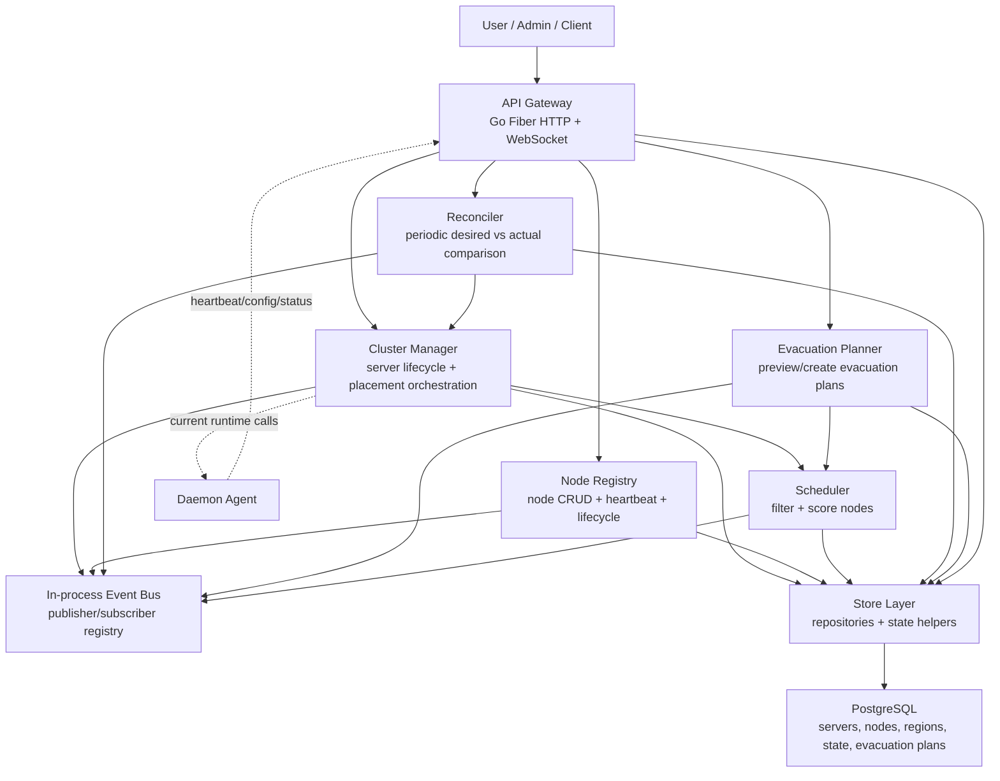

# Architecture Review - Phase 7 Checkpoint

Date: 2026-06-14

Scope: Review after Phase 0 through Phase 7 foundations. This is an architecture checkpoint only. It does not introduce new product behavior.

## 1. Current Architecture Diagram

Current implementation is still a single API deployable containing control-plane services. That is acceptable for foundation phases, but service boundaries must continue to harden before separate deployment or distributed messaging.

## 2. Domain Review

### Cluster

Current state:
- `Cluster` exists in `internal/domain` as a simple struct with `ID`, `Name`, `Regions`, timestamps.
- There is no persisted cluster table, cluster identity, membership model, or cluster-level policy.

Missing fields:
- Cluster UUID or stable public ID.
- Default scheduling policy.
- Enabled/disabled state.
- Control-plane ownership/tenant context.
- Region membership as persistent relationship.

Boundary issues:
- Cluster is currently documentation/domain vocabulary, not an operational aggregate.
- Region, Node, Scheduler, and Evacuation Planner operate without an explicit cluster scope.

### Region

Current state:
- Region is first-class and persisted.
- Nodes belong to regions through `nodes.region_id`.
- Server creation supports region-driven placement.

Missing fields:
- Customer-facing availability status beyond `enabled`.
- Capacity policy, allowed runtime providers, labels, zones, failure domains.
- Region-level maintenance state.

Boundary issues:
- Legacy `nodes.region` string still coexists with `region_id`.
- Region capacity is computed through Cluster Manager but stored through Node/Server tables.

### Node

Current state:
- Nodes have desired state (`active`, `maintenance`, `draining`) and actual state (`online`, `offline`, `degraded`).
- Node Registry owns heartbeat and lifecycle views.
- Scheduler blocks offline, maintenance, and draining nodes.

Missing fields:
- Labels/taints/capabilities.
- Runtime providers supported by node.
- Failure domain / rack / zone.
- Last health evaluation timestamp separate from heartbeat timestamp.
- Explicit drain started/completed timestamps.
- Evacuation policy.

Duplicated ownership:
- Store helpers mutate node desired/actual state.
- Node Registry wraps node updates and publishes lifecycle events.
- Scheduler independently interprets node eligibility.
- `status`, `maintenance_mode`, and `draining` still mirror desired/actual state for compatibility.

### Server

Current state:
- Servers have persisted desired and actual state.
- Cluster Manager owns server create/delete/power pathways at service level.
- Store still contains low-level power/status mutation helpers.

Missing fields:
- Region ID on server. Region is inferred through node, which becomes problematic after migration/failover planning.
- Workload identity separate from server record.
- Desired placement or placement constraints.
- Current placement record/history.
- Runtime provider/instance ID abstraction.

Duplicated ownership:
- Cluster Manager mutates desired state.
- Reconciler mutates actual state via Cluster Manager refresh.
- Store helpers still synchronize legacy `status`.
- Some HTTP paths still call store directly for install and transfer status workflows.

### Placement

Current state:
- Placement request/decision exists in domain.
- Scheduler filters and scores nodes.
- Cluster Manager publishes `PlacementCreated`.

Missing fields:
- Durable placement record/table.
- Placement request ID.
- Rejection reason collection.
- Constraint model beyond region/resource/preferred/required node.
- Reservation/commit lifecycle.

Boundary issues:
- Allocation selection is still partly Cluster Manager/store behavior.
- Scheduler has in-memory metrics but no durable decision log.

### EvacuationPlan

Current state:
- Domain structs and store structs exist.
- Migration adds `evacuation_plans` and `evacuation_items`.
- Evacuation Planner previews and creates plans without execution.

Missing fields:
- Plan reason (`drain`, `maintenance`, `manual`, `failure`).
- Actor/user ID.
- Plan summary counts.
- Candidate score/reasons persisted per item.
- Capacity impact persisted per item.
- Region or policy snapshot.

Boundary issues:
- Planner reuses Scheduler filtering/scoring but also performs its own reserved-capacity simulation.
- Plan status uses `completed` to mean "planning completed", not "evacuation executed"; this should be renamed or clarified before migration engine work.

### Runtime

Current state:
- Runtime domain struct exists.
- Daemon runtime is Docker-backed.
- Cluster Manager still calls daemon APIs directly.

Missing fields:
- Runtime provider ID.
- Runtime capabilities model.
- Runtime instance state separate from server state.
- Runtime health/errors.

Boundary issues:
- Runtime abstraction is not yet implemented.
- Docker assumptions remain in daemon and node heartbeat (`docker_status`).

### Event

Current state:
- In-process event envelope exists.
- Event types cover server, node, placement, state, evacuation plan.
- Registry supports publisher/subscriber and wildcard subscriptions.

Missing fields:
- Version.
- Correlation ID / causation ID.
- Actor ID.
- Idempotency key.
- Trace/request ID.
- Tenant/cluster ID.
- Error/retry metadata.

Boundary issues:
- Events are process-local and synchronous.
- Store state transitions and Event Bus events are separate timelines.
- No subscribers exist yet, so delivery metrics remain mostly unused.

## 3. Service Review

### Cluster Manager

Strengths:
- Owns server creation placement flow.
- Owns server power request pathway.
- Publishes lifecycle and placement events.

Concerns:
- Still directly depends on daemon client.
- Performs allocation fallback selection itself.
- Uses store helpers that synchronize legacy status fields.
- `StartServer`, `StopServer`, `RestartServer`, and `KillServer` bypass desired-state mutation when called directly by Reconciler.

Recommended cleanup:
- Split desired-state requests from actual execution commands.
- Introduce Runtime Layer before deeper failover work.
- Move allocation reservation/commit into a placement or allocation service.

### Scheduler

Strengths:
- Filters by online state, maintenance/draining, region, and capacity.
- Scores by available memory, CPU, and disk.
- Emits capacity-exceeded events.

Concerns:
- Metrics are in-memory only.
- Rejection reasons are not returned to callers as structured data.
- CPU uses `cpu_shares` semantics and total CPU is `cpu_threads * 1024`, which is a Docker-era approximation.
- No labels, affinity, anti-affinity, runtime capability, or failure-domain support.

Recommended cleanup:
- Return structured rejection reasons.
- Create durable placement decision logs.
- Introduce resource units independent of Docker CPU shares.

### Node Registry

Strengths:
- Owns node CRUD, heartbeat, health view, lifecycle view.
- Publishes node health/lifecycle events.
- Exposes placement eligibility.

Concerns:
- Store update still handles desired-state compatibility mapping.
- Health score is advisory and embedded in service, not a policy module.
- Node actual state is heartbeat-driven only; no active probing or timeout-based offline marking.

Recommended cleanup:
- Add heartbeat expiry/offline evaluator.
- Separate health scoring policy from Node Registry CRUD.
- Add drain timestamps and drain reason.

### Reconciler

Strengths:
- Provides desired-vs-actual comparison loop.
- Refreshes node capacity and server actual state.
- Routes corrective server actions through Cluster Manager.

Concerns:
- No leader election; multiple API replicas would run loops.
- Publishes desired/actual comparison events every loop, likely noisy.
- Server actual-state refresh relies on daemon stats only when desired/running conditions match.
- Direct calls to `StartServer`/`StopServer` mutate actual state immediately rather than only requesting desired state.

Recommended cleanup:
- Add lease/leader election before multi-replica deployment.
- Reduce event noise with only-on-change or reconciliation result events.
- Rework actions into desired-state requests plus executor results.

### Evacuation Planner

Strengths:
- Does not execute movement.
- Reuses Scheduler filtering/scoring.
- Simulates per-plan reserved capacity.
- Persists plan/items and emits planning events.

Concerns:
- Plan `completed` status means "planning finished", not "workloads evacuated".
- Candidate score and capacity impact are returned in preview but not persisted.
- It increments candidate metrics on previews, which may make metrics noisy.
- It currently plans every server on a node, not only workloads requiring evacuation by policy.

Recommended cleanup:
- Rename statuses or add `phase`/`execution_status` before migration work.
- Persist score, reason, and capacity impact.
- Separate preview metrics from created-plan metrics.
- Add plan reason and actor.

## 4. Event Review

Current event types:
- Server: `ServerCreated`, `ServerDeleted`, `ServerStarted`, `ServerStopped`, `ServerRestarted`.
- Node: `NodeOnline`, `NodeOffline`, `NodeDegraded`, `NodeDrainingStarted`, `NodeDrainingCompleted`, `NodeMaintenanceStarted`, `NodeMaintenanceEnded`, `NodeCapacityExceeded`.
- Placement/state: `PlacementCreated`, `DesiredStateChanged`, `ActualStateChanged`.
- Evacuation: `EvacuationPlanCreated`, `EvacuationPlanCompleted`, `EvacuationPlanFailed`, `EvacuationCandidateSelected`.

Missing events:
- `ServerDesiredStateChanged` and `ServerActualStateChanged` as explicit typed variants.
- `NodeDesiredStateChanged` and `NodeActualStateChanged` as explicit typed variants.
- `PlacementRejected`.
- `PlacementFailed`.
- `EvacuationPlanPreviewed` if previews need observability.
- `EvacuationItemEvaluated`.
- `NodeHeartbeatReceived`.
- `NodeHeartbeatExpired`.
- `ServerCrashed`.
- `ServerInstallStarted`, `ServerInstallCompleted`, `ServerInstallFailed`.

Potentially unnecessary/noisy events:
- Generic `DesiredStateChanged`/`ActualStateChanged` from Reconciler every cycle can become noisy.
- `EvacuationCandidateSelected` on previews may inflate event volume and candidate metrics.

Duplication:
- State transitions table and Event Bus both record state facts, but they are not linked.
- Node lifecycle events overlap with generic desired-state events.
- Server power events overlap with generic actual-state events.

Recommendation:
- Add event versioning, actor/correlation IDs, and state transition ID linkage before moving to NATS.
- Publish events primarily on state change or decision completion, not on every comparison loop.

## 5. Data Model Review

### Servers

Strengths:
- Desired and actual state are persisted independently.
- Legacy `status` remains synchronized for compatibility.

Problems:
- No direct `region_id`; region is inferred through current node.
- `status`, `desired_state`, and `actual_state` can drift if any old path updates only `status`.
- Runtime identity is missing.
- Placement history is missing.

Scalability concerns:
- Capacity calculations aggregate over `servers` on demand.
- Server records carry both workload and runtime lifecycle concerns.

### Nodes

Strengths:
- Desired/actual state support lifecycle control.
- Region relationship exists.
- Heartbeat metadata exists.

Problems:
- Legacy `status`, `maintenance_mode`, and `draining` duplicate desired/actual state.
- `docker_status` is runtime-specific.
- No indexes specifically shown for desired/actual state beyond combined state index.

Scalability concerns:
- Health scoring is computed per request.
- No heartbeat expiry job.

### Regions

Strengths:
- First-class region table exists.
- Backfilled from locations.

Problems:
- Legacy locations still exist.
- Region has no capacity or policy metadata.

### Placements

Strengths:
- Placement decision model exists.

Problems:
- No placement table.
- No durable placement decision/rejection history.
- No capacity reservation.

### Evacuation Plans

Strengths:
- Plans/items are persisted.
- Items link source, target, server, eligibility, and reason.

Problems:
- No actor, reason, score, capacity impact, or policy snapshot.
- `completed` status is semantically ambiguous.
- No uniqueness or supersession model for repeated plans.

### State Transitions

Strengths:
- Lightweight transition history exists.

Problems:
- Uses generic text fields rather than typed resource/state references.
- No actor/correlation/event linkage.
- No indexes by state kind.

### Migration Concerns

Potential issues:
- Migration filenames include duplicate numeric prefixes (`015`, `018`), relying on full filename sorting.
- `CREATE TYPE` statements do not use `IF NOT EXISTS`; safe under normal `schema_migrations`, but brittle for partially applied databases.
- Migration runner splits SQL by semicolon and does not understand procedural SQL blocks, limiting future migrations.

## 6. Technical Debt Report

Dead or near-dead code:
- Domain `Cluster` and `Runtime` are placeholders with no operational backing.
- Store `SetNodeDesiredState` and `SetNodeActualState` exist but most node updates currently go through `UpdateNode`/heartbeat paths.

Compatibility layers:
- `servers.status` mirrors `actual_state`.
- `nodes.status`, `maintenance_mode`, and `draining` mirror desired/actual state.
- Legacy region string remains alongside `region_id`.
- Docker-specific heartbeat fields remain.

Temporary implementations:
- In-process Event Bus.
- In-memory metrics for scheduler/reconciler/events/evacuation planner.
- Reconciler loop inside API process.
- Health scoring embedded in Node Registry.
- Evacuation Planner plans only; no execution model.
- Capacity is computed from current tables, not reservation/commit records.

Process/documentation debt:
- Phase 7 implementation is present in code, but the previous task tracker still reflected Phase 6 at the time of this review. Treat Phase 7 closeout documentation as part of the continuity cleanup before beginning the next implementation phase.

Migration candidates:
- Add placement/placement_decisions table.
- Add server `region_id` or workload placement intent.
- Add runtime provider/instance tables.
- Add event outbox before distributed messaging.
- Add state transition actor/correlation/event IDs.
- Convert duplicate legacy status fields into compatibility read views once frontend/API consumers migrate.

## 7. Future Readiness Review

### Migration Engine

Readiness: Medium.

Ready foundations:
- Evacuation plans/items exist.
- Scheduler can identify eligible targets.
- Node draining blocks new placement.
- Capacity validation exists.

Blocking gaps:
- No migration execution state machine.
- No transfer/backup handoff integration.
- Plan status semantics need refinement.
- No source/target runtime compatibility checks.
- No allocation reservation for target node.

### Failover

Readiness: Low to Medium.

Ready foundations:
- Node actual state exists.
- Reconciler exists.
- Evacuation planning exists.

Blocking gaps:
- No heartbeat expiry/offline detection policy.
- No automated plan trigger.
- No data recovery/backup restore workflow.
- No leader election.
- No runtime abstraction.

### Runtime Abstraction

Readiness: Medium.

Ready foundations:
- Runtime is documented as a domain.
- Daemon runtime has some interface shape.
- Control-plane services are becoming modular.

Blocking gaps:
- Cluster Manager still calls daemon directly.
- Docker terms remain in node heartbeat and daemon runtime.
- Resource units are Docker-shaped.
- No runtime provider registry/capability negotiation.

### NATS / Distributed Events

Readiness: Medium.

Ready foundations:
- Event envelope exists.
- Publisher/subscriber interfaces exist.
- Event names are centralized.

Blocking gaps:
- No event versioning.
- No outbox table.
- No idempotency/correlation fields.
- No subscriber retry/dead-letter design.
- Current Event Bus is synchronous and process-local.

### Observability

Readiness: Medium.

Ready foundations:
- Metrics endpoint exists.
- Reconciler, event, scheduler, node draining, and evacuation metrics exist.
- State transitions and audit rows exist.

Blocking gaps:
- Metrics are mostly process-local and reset on restart.
- No structured logs or traces.
- No durable event/decision stream.
- Health scoring is not persisted.
- No dashboards or alerting rules beyond existing infra stubs.

## 8. Recommended Next Phase

Recommendation: C) Runtime Abstraction.

Justification:
- Migration Engine and Failover both require reliable runtime-neutral operations: inspect, stop, start, snapshot/archive, restore, attach network, bind allocations, and report actual state.
- The current Cluster Manager still talks directly to daemon APIs, and daemon internals are Docker-backed.
- Capacity and CPU semantics still reflect Docker-era assumptions.
- Introducing Runtime Abstraction before execution-oriented migration/failover avoids baking Docker and daemon-specific behavior into the next major orchestration layer.

Why not Migration Engine next:
- Evacuation Planner can identify targets, but execution would immediately need runtime-neutral copy/snapshot/restore and target-instance creation semantics.

Why not Failover next:
- Failover depends on migration execution, heartbeat expiry policy, leader election, and runtime abstraction.

Why not Observability next:
- Observability would help, but runtime abstraction is a deeper blocker for safe orchestration evolution. Observability should follow shortly after runtime boundaries begin hardening.

## Summary Findings

Highest-priority architecture risks:
- Runtime coupling remains the largest blocker.
- State ownership is improved but still split between services and store helpers.
- Event foundation exists but needs versioning/correlation/outbox before distributed messaging.
- Placement lacks durable decision/reservation records.
- Reconciler needs leader election before horizontal API scaling.

Overall assessment:
- The platform has successfully moved from panel-shaped CRUD toward control-plane foundations.
- The next safest investment is runtime abstraction, followed by migration engine execution, then failover and deeper observability.
