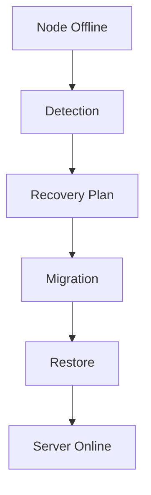

# Failover Readiness Audit

Date: 2026-06-14

Scope: Phase 10.5 architecture audit after the Observability Platform Foundation.

This audit is analysis only. No features, failover execution, recovery execution, builds, tests, linting, typechecking, docker commands, or validation commands were performed.

## Executive Summary

The Observability Platform moved GamePanel forward in the right order. The system now has durable timeline data, correlation IDs, heartbeat history, health history, and observability APIs. That makes future failover work diagnosable.

The architecture is not ready for Failover & Recovery execution yet.

The most important missing piece is heartbeat expiry. Current data can show that a node has reported recently, failed a heartbeat request, or has a widening heartbeat gap, but the control plane does not yet evaluate that data into a reliable `online`, `offline`, or `unreachable` classification. Without that, recovery automation would either fail to trigger or trigger on weak evidence.

After heartbeat expiry, the next blockers are placement reservations, migration/reconciliation coordination, and restore ownership.

Recommendation: C) Build Heartbeat Expiry Engine.

## 1. Heartbeat Expiry

Question: Can the system reliably determine Node Online, Node Offline, and Node Unreachable using current data?

Answer: Not yet.

What exists:

- Nodes have persisted desired and actual state.
- Node heartbeat submissions update `last_seen_at` and actual state.
- Heartbeat submissions are recorded in `node_heartbeat_history`.
- Heartbeat failures can be recorded.
- Heartbeat gaps are persisted.
- Health snapshots include heartbeat score.
- Timeline and correlation APIs can expose node-related events.

What is missing:

- No control-plane heartbeat expiry evaluator.
- No configurable heartbeat timeout.
- No grace period or failure threshold.
- No distinction between `offline` and `unreachable`.
- No `NodeHeartbeatMissed` or `NodeUnreachable` event.
- No automated state transition from stale heartbeat data.
- No recovery trigger emitted from heartbeat expiry.

Current classification ability:

| State | Current Reliability | Reason |
| --- | --- | --- |
| Node Online | Medium | Recent successful heartbeat can support online status. |
| Node Offline | Low | Offline can be represented, but stale heartbeat data does not automatically transition the node. |
| Node Unreachable | Very low | No separate unreachable state, timeout evaluator, or network reachability policy exists. |

Conclusion: Observability data is sufficient to build a heartbeat expiry engine, but the engine does not exist yet.

## 2. Placement Reservations

Questions:

- Can workload placement be reserved safely?
- Can double placement occur?
- Can capacity races occur?

Answer: Placement cannot be reserved safely yet.

What exists:

- Scheduler filters nodes by region, lifecycle state, actual state, and available resources.
- Scheduler scores candidate nodes.
- Cluster Manager consumes placement decisions during server creation.
- Evacuation Planner and Migration Service reuse Scheduler capacity checks.
- `PlacementCreated` events are captured into the timeline.
- Node capacity and health snapshots are visible.

What is missing:

- No durable placement reservation table.
- No reservation status.
- No reservation expiration.
- No reservation commit/rollback.
- No transactional capacity hold.
- No idempotency key for placement attempts.
- No durable rejected-placement record.

Risk:

- Two concurrent server creates or migrations can both observe the same available capacity.
- Both can select the same node before either commits workload allocation.
- Evacuation and migration planning can overestimate available capacity because capacity is computed, not reserved.

Conclusion: Double placement and capacity races remain possible under concurrent orchestration. Failover execution should not proceed until placement reservations exist.

## 3. Migration Coordination

Questions:

- Can multiple migrations conflict?
- Can migrations be tracked safely?

Answer: Migrations can be tracked as intent, but not safely coordinated for execution.

What exists:

- Migration records are durable.
- Migration status history is durable.
- Migration events are published and timeline-captured.
- Migration events use correlation IDs.
- Migration validation uses source/target nodes and Scheduler/Evacuation Planner capacity checks.

What is missing:

- No migration lock per server.
- No active-migration uniqueness guard.
- No placement reservation connected to migration.
- No migration execution.
- No server placement update.
- No backup/archive/restore handoff.
- No rollback model.
- Reconciler does not pause or coordinate with active migrations.

Conflict examples:

- Two migrations for the same server could be planned independently.
- Reconciler can act on a server while migration intent exists.
- Evacuation plans and migrations are not durably linked.
- Multiple planned migrations can target the same remaining capacity without reservations.

Conclusion: Migration history is now inspectable, but execution coordination is not ready.

## 4. Restore Ownership

Question: Which service owns restore decisions, recovery execution, and runtime interaction?

Current ownership:

| Concern | Current Owner | Readiness |
| --- | --- | --- |
| Restore decisions | No clear owner | Not ready |
| Recovery execution | No Recovery Coordinator exists | Not ready |
| Runtime interaction | Cluster Manager uses Runtime for create/delete/power/stats; Docker adapter wraps daemon | Partial |
| Backup/restore operations | Still daemon/API-handler coupled | Not ready |
| Migration execution | Migration Service owns state, but execution is state-machine-only | Foundation only |

Current gap:

Restore is not yet a control-plane concept. It is not owned by Cluster Manager, Migration Service, Runtime Layer, or a Recovery Coordinator. Backup and restore remain daemon-coupled and do not have runtime-neutral contracts.

Conclusion: Restore ownership must be designed before failover can recover workloads.

## 5. Event Reliability

Question: Can failover rely on current events?

Answer: No, not as the execution source of truth.

What improved in Phase 10:

- Event envelopes now carry correlation IDs.
- Event-derived timeline entries are durable.
- Timeline storage is idempotent by event ID.
- Operators can query timeline events globally, by resource, and by correlation.

Remaining risks:

- Event Bus dispatch remains in-process.
- No distributed broker exists.
- No retry or dead-letter mechanism exists.
- No ordering guarantees exist across API processes.
- No event replay mechanism exists.
- Timeline persistence captures events after they are published in the API process; it is not yet a transactional outbox.
- Some important future events are still missing, including heartbeat missed, placement reserved, placement committed, restore started, restore completed, and recovery plan events.

Conclusion: Timeline events are excellent for observability. Failover execution should still rely on durable state and transactional records, not in-process event delivery.

## 6. Recovery Flow Review

Target flow:

Current readiness by step:

| Step | Current Status | Missing Pieces |
| --- | --- | --- |
| Node Offline | Representable but not reliably derived | Heartbeat expiry evaluator, unreachable state, timeout policy, missed-heartbeat events |
| Detection | Not automated | Detection loop, thresholds, state transition ownership, recovery trigger policy |
| Recovery Plan | Not implemented | Recovery plan domain, affected server enumeration, operator approval/dry-run, policy snapshot |
| Migration | Intent only | Server locks, placement reservations, execution semantics, rollback, server placement update |
| Restore | Not owned | Runtime-neutral archive/restore contract, restore service, restore events, artifact tracking |
| Server Online | Partially observable | Post-restore health checks, desired/actual reconciliation locks, success criteria |

Critical missing pieces:

- Heartbeat Expiry Engine.
- Recovery Plan domain.
- Placement Reservation domain.
- Migration/reconciliation coordination locks.
- Runtime-neutral restore ownership.
- Recovery execution state machine.
- Recovery and restore event contracts.

Conclusion: The full recovery flow cannot execute safely. The first safe next step is automated failure classification, not recovery execution.

## 7. Readiness Score

| Area | Score | Reason |
| --- | ---: | --- |
| Heartbeat Readiness | 45% | Heartbeat history and health data exist, but no expiry evaluator or unreachable classification exists. |
| Migration Readiness | 35% | Durable migration state exists, but execution, locks, reservations, placement commit, rollback, and restore are missing. |
| Recovery Readiness | 20% | Observability exists, but no recovery plan domain, trigger policy, restore owner, or recovery state machine exists. |
| Failover Readiness | 15% | Failover needs all prior layers plus safe automation; the architecture is still pre-execution. |

## 8. Recommendation

Recommendation: C) Build Heartbeat Expiry Engine.

Why not A) Proceed to Failover & Recovery:

- The system cannot yet reliably classify a node as unreachable from persisted heartbeat data.
- Placement is not reservable.
- Migration execution is not implemented.
- Restore ownership is undefined.
- Events are not reliable enough to drive execution.

Why not B) Build Placement Reservations first:

- Placement reservations are critical, but they are downstream of failure detection in the recovery flow. The system must first know when a node has crossed an offline or unreachable threshold.

Why not D) Build Recovery Coordinator first:

- A Recovery Coordinator would depend on heartbeat expiry, placement reservations, migration locks, and restore ownership. Building it first would create a coordinator with no reliable trigger or safe execution primitives.

Recommended scope for the next phase:

- Add heartbeat expiry policy.
- Add a control-plane evaluator that scans last heartbeat/history.
- Add node classification for online, degraded, offline, and unreachable.
- Persist evaluator decisions as state transitions.
- Publish and timeline-capture `NodeHeartbeatMissed` and `NodeUnreachable` events.
- Do not create recovery plans automatically yet.
- Do not execute migration, restore, failover, or recovery.

## Final Verdict

GamePanel is observability-ready for failover design, but not execution-ready for failover.

Proceed with Heartbeat Expiry Engine as the next foundation. Keep Failover & Recovery execution blocked until heartbeat expiry, placement reservations, migration coordination, and restore ownership are all implemented and reviewed.
