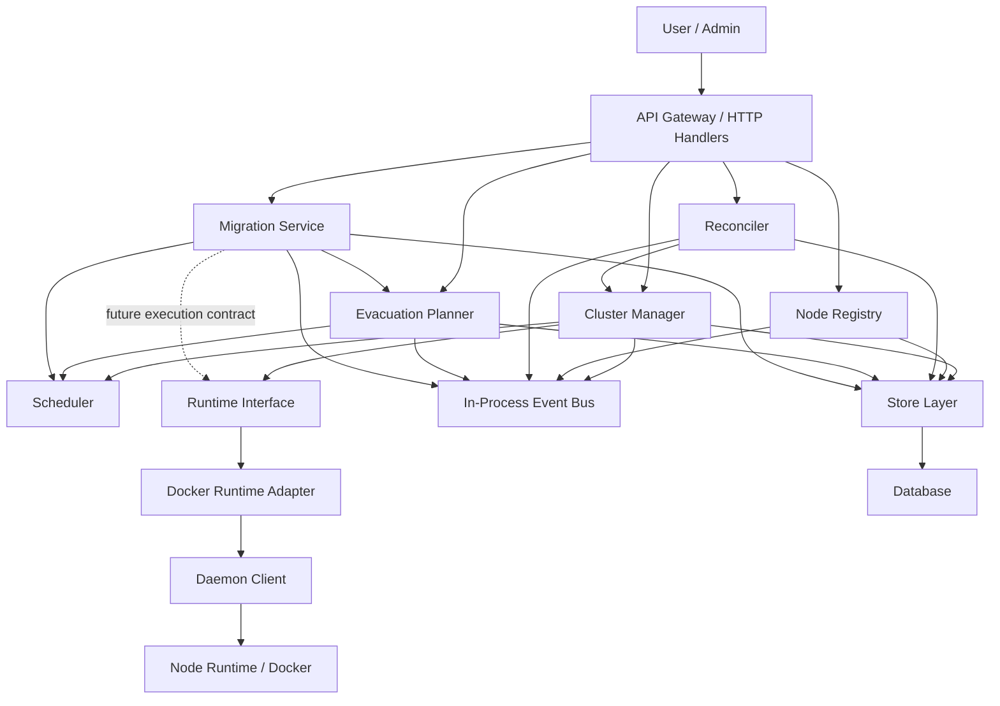
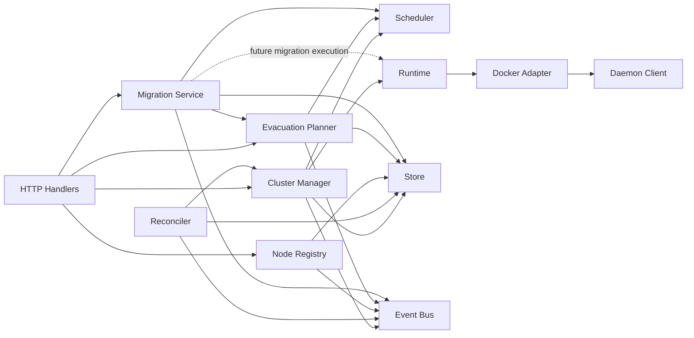
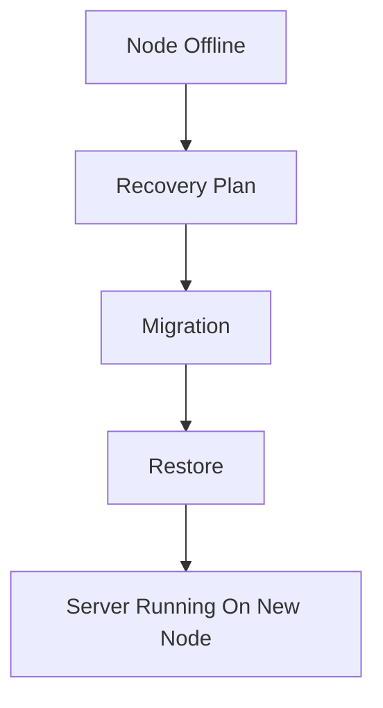

# Phase 9.5 Orchestration Architecture Audit

Date: 2026-06-14

Scope: Architecture review after Phase 9 Migration Engine Foundation. This is an analysis-only checkpoint. No Phase 10 work, feature implementation, builds, tests, linting, typechecking, docker commands, or validation commands were performed.

## Executive Summary

GamePanel now has the core orchestration foundations in place: first-class regions and nodes, scheduler placement, a Cluster Manager, reconciler, persisted desired and actual state, an in-process event bus, node lifecycle controls, evacuation planning, runtime abstraction, and durable migration records.

The architecture is ready for deeper operational visibility, but it is not yet ready for automatic failover. The main blockers are missing durable placement reservations, no heartbeat-expiry/offline detector, migration execution that is intentionally state-machine-only, restore still coupled to daemon workflows, process-local events and metrics, and split ownership between Cluster Manager, Reconciler, Scheduler, Node Registry, Evacuation Planner, and Migration Service.

Recommended Phase 10: Observability Platform.

## Current Architecture Diagram

## Ownership Matrix

| Capability | Current Owner | Supporting Components | Ownership Issues |
| --- | --- | --- | --- |
| Placement | Scheduler filters and scores nodes. Cluster Manager consumes placement decisions during server creation. | Node Registry exposes lifecycle and placement eligibility. Evacuation Planner and Migration Service reuse Scheduler validation. | Cluster Manager still contains allocation fallback logic. Placement decisions are emitted as events but not persisted or reserved. Node Registry duplicates parts of Scheduler eligibility. |
| Migration | Migration Service owns migration records, status transitions, history, validation, and API workflow. | Scheduler validates target nodes. Evacuation Planner finds candidates and validates capacity. Runtime interface defines future migration contracts. | Runtime dependency exists but Phase 9 execution intentionally does not call it. Migration does not reserve capacity, update server node assignment, restore backups, or coordinate with Reconciler. |
| Reconciliation | Reconciler owns periodic desired-vs-actual comparison and state refresh. | Cluster Manager performs runtime actions. Store persists desired/actual state. Event Bus publishes state comparisons. | Reconciler calls Cluster Manager action methods that also mutate actual state. Reconciler is not migration-aware and has no leader election or lease. |
| Runtime Operations | Runtime interface and registry own provider abstraction. Docker adapter wraps daemon client. | Cluster Manager uses Runtime for create/delete/power/stats/inspect paths. | Many operational paths remain daemon-coupled: install, files, backups, realtime console/logs, some stats, and daemon heartbeat payloads. Docker-shaped fields still leak upward. |
| Node Lifecycle | Node Registry owns registration, updates, heartbeat, desired state, actual state, lifecycle events, and cluster visibility. | Scheduler blocks offline, maintenance, and draining nodes. Reconciler refreshes node capacity. | No heartbeat expiry evaluator. Health scoring is embedded in Node Registry. Scheduler and Node Registry both compute placement eligibility. |

## Dependency Diagram

## Domain Review

### Cluster

The Cluster domain exists as a placeholder but is not yet a persisted aggregate or ownership boundary. There is no cluster-scoped policy, scheduling profile, failure domain model, or multi-cluster database partitioning strategy.

Risk: Future multi-cluster support may be forced into region/node tables without a clean aggregate root.

### Region

Regions are first-class customer-facing domains and nodes belong to regions. This is the correct direction.

Missing fields:

- Region-level capacity policy.
- Region health summary.
- Failure-domain grouping.
- Placement policy metadata.
- Runtime capability requirements.

Risk: Region currently acts mainly as a grouping/filtering field instead of a control-plane policy boundary.

### Node

Nodes are first-class infrastructure resources with desired and actual state. Node lifecycle states support active, maintenance, and draining behavior.

Missing fields:

- Heartbeat expiry timestamp or last successful health evaluation.
- Failure domain, rack, zone, or provider metadata.
- Labels, taints, and placement constraints.
- Runtime provider and runtime capability snapshot.
- Drain reason, maintenance reason, and lifecycle actor.

Hidden coupling:

- Node health still contains Docker-shaped runtime status.
- Placement eligibility is computed in both Node Registry and Scheduler.

### Server

Servers have desired and actual state and remain tied to a selected node. Server creation can now route through region-aware placement.

Missing fields:

- Durable current placement record.
- Region ownership directly on the persisted server model where needed for efficient querying.
- Runtime provider/runtime instance identifier.
- Migration lock or reconciliation lock.
- Last reconciled timestamp and reconciliation error.

Risk: Legacy status compatibility can drift from desired/actual state if future flows mutate the wrong field.

### Placement

Placement exists as request/decision domain models and events. It is not yet a durable resource.

Missing fields:

- Placement ID.
- Reservation status.
- Resource reservation amounts.
- Expiration timestamp.
- Rejection reasons.
- Scheduler policy version.

Risk: Failover and migration cannot safely rely on placement without durable reservations or idempotency.

### EvacuationPlan

Evacuation plans identify what should move and candidate targets. They do not execute movement, which matches Phase 7 scope.

Boundary issue:

- Status `completed` means planning completed, not evacuation completed. This can be misread once migration/failover work begins.

Missing fields:

- Plan type or reason.
- Actor.
- Link to generated migrations.
- Capacity impact summary.
- Policy snapshot.

### Migration

Migration is now a durable control-plane resource with history and status transitions.

Current limitation:

- Execution only advances the state machine. It does not transfer data, restore backups, call runtime migration, reserve capacity, or update server placement.

Missing fields:

- Reason and actor.
- Link to evacuation plan item.
- Runtime provider and capability snapshot.
- Backup artifact reference.
- Rollback state.
- Idempotency key.
- Reconciliation lock.

## Service Review

### Cluster Manager

Strengths:

- Owns the server creation flow and now depends on Scheduler and Runtime abstractions.
- Persists desired state before requested power operations.
- Publishes placement and server lifecycle events.

Issues:

- Still contains allocation fallback logic, which weakens Scheduler ownership.
- Direct start/stop/restart methods mutate actual state while also being used by Reconciler.
- Delete and status flows still rely on legacy server status compatibility.

### Scheduler

Strengths:

- Centralized region-aware, lifecycle-aware, capacity-aware filtering.
- Simple scoring is understandable and deterministic.

Issues:

- Rejection reasons are not first-class structured results.
- No reservation support.
- No labels, taints, affinity, anti-affinity, runtime capability constraints, or failure-domain constraints.
- CPU remains tied to Docker-style shares in parts of the capacity model.

### Node Registry

Strengths:

- Central node lifecycle owner.
- Exposes useful lifecycle and capacity visibility.
- Publishes node state events.

Issues:

- No heartbeat expiry/offline evaluator.
- Health scoring belongs near an observability or health-evaluation boundary long term.
- Placement eligibility overlaps with Scheduler filtering.

### Reconciler

Strengths:

- Introduces desired-state architecture and periodic refresh.
- Persists actual state observations.

Issues:

- No leader election or process lease.
- Not migration-aware.
- State events can be noisy because desired/actual comparison events are emitted during reconciliation.
- Runtime actions flow through Cluster Manager methods that also mutate actual state.

### Event Bus

Strengths:

- Provides a common publish/subscribe foundation.
- Event definitions cover servers, nodes, placement, evacuation, runtime, state, and migration.

Issues:

- In-process only.
- Synchronous dispatch.
- No durable log, retry, dead-letter handling, ordering guarantees, idempotency key, correlation ID, causation ID, actor, tenant, or cluster scope.

### Evacuation Planner

Strengths:

- Correctly separates planning from execution.
- Reuses Scheduler and capacity validation.
- Simulates target capacity while building plans.

Issues:

- Candidate-selected events can be emitted during preview/planning and may become noisy.
- Completed status is semantically ambiguous.
- No durable link to migrations.

### Migration Service

Strengths:

- Owns migration state, history, validation, and APIs.
- Correctly avoids workload movement in Phase 9.
- Reuses existing scheduler and evacuation capacity paths.

Issues:

- Runtime field is present for future contracts but not used by state-machine-only execution.
- No prepare/execute API exists yet, so started/completed events may not appear from normal external API use.
- No capacity reservation or server placement mutation.
- No protection against Reconciler acting on a server during a migration.

## Runtime Layer Review

The Runtime interface is the right boundary for future Docker, containerd, Podman, Firecracker, Kubernetes, or Nomad support. The Docker adapter correctly preserves current behavior by wrapping the existing daemon client.

Remaining daemon coupling:

- Server install and provisioning.
- File operations.
- Backup operations.
- Realtime console, logs, and stats proxy paths.
- Scheduled backup tasks.
- Daemon-specific node authentication and heartbeat vocabulary.

Remaining Docker coupling:

- Docker status exposed in node health.
- Docker image assumptions.
- Docker-shaped CPU shares.
- Daemon internals still use Docker SDK/runtime behavior.
- Some naming still uses daemon/Docker concepts rather than runtime-neutral terms.

## State Management Review

Desired and actual state are now persisted independently for servers and nodes. This is a major architectural improvement.

Current gaps:

- State transitions, events, and migration history are separate timelines with no shared correlation ID.
- Migration state is not tied to server desired/actual state.
- Reconciler is not aware of migration locks or transitional ownership.
- Node offline detection depends on explicit updates rather than heartbeat expiry.
- Legacy status compatibility remains a drift risk.

## Event Review

Current event types:

- ServerCreated
- ServerDeleted
- ServerStarted
- ServerStopped
- ServerRestarted
- NodeOnline
- NodeOffline
- NodeDegraded
- NodeDrainingStarted
- NodeDrainingCompleted
- NodeMaintenanceStarted
- NodeMaintenanceEnded
- NodeCapacityExceeded
- PlacementCreated
- DesiredStateChanged
- ActualStateChanged
- EvacuationPlanCreated
- EvacuationPlanCompleted
- EvacuationPlanFailed
- EvacuationCandidateSelected
- RuntimeRegistered
- RuntimeUnavailable
- RuntimeCapabilityChanged
- MigrationCreated
- MigrationStarted
- MigrationCompleted
- MigrationFailed
- MigrationCancelled

Missing events:

- PlacementRejected
- PlacementReserved
- PlacementReservationExpired
- ServerPlacementChanged
- NodeHeartbeatMissed
- NodeHealthEvaluated
- ReconciliationStarted
- ReconciliationCompleted
- ReconciliationFailed
- MigrationPrepared
- MigrationTransferStarted
- MigrationRestoreStarted
- MigrationRollbackStarted
- MigrationRollbackCompleted
- BackupArtifactCreated
- RestoreStarted
- RestoreCompleted
- RestoreFailed

Duplicate or unclear events:

- DesiredStateChanged and ActualStateChanged are too generic. They should eventually become resource-specific or carry a strict schema.
- MigrationStarted is currently used for prepare/execute movement through the state machine; MigrationPrepared would be clearer later.
- EvacuationPlanCompleted can be confused with actual evacuation completion.

Unused or low-signal events:

- RuntimeCapabilityChanged is foundational but has limited current usage with only the Docker runtime.
- MigrationCompleted can be emitted by state-machine-only execution, so consumers must not assume workload movement occurred.

## Technical Debt Report

Shortcuts and temporary implementations:

- Migration execution is state-machine-only.
- Docker migration methods intentionally return `ErrNotImplemented`.
- Runtime abstraction does not yet cover all daemon operations.
- Cluster domain is not persisted or behaviorally meaningful yet.
- Placement decisions are not durable.
- Capacity is computed/snapshotted but not transactionally reserved.
- Event Bus, runtime metrics, scheduler metrics, and migration metrics are in-memory.
- Reconciler has no leader election.
- Heartbeat processing has no expiry-driven offline detector.
- Store layer still maintains legacy status compatibility.

Future risks:

- Automatic failover could double-act if Reconciler, Migration Service, and Cluster Manager are not coordinated by locks or ownership markers.
- Process-local events and metrics will disappear on restart and cannot support distributed automation.
- Without durable placement reservations, concurrent migrations or server creates may overcommit a node.
- Runtime expansion before daemon coupling is reduced will create provider-specific behavior leaks.
- Ambiguous evacuation status semantics could confuse operators and automation.

## Failover Readiness Assessment

Target flow:

| Step | Readiness | Assessment |
| --- | --- | --- |
| Node Offline | Partial | Node actual state can represent offline/degraded, but there is no heartbeat-expiry evaluator or automated failure classification. |
| Recovery Plan | Partial | Evacuation Planner can identify affected servers and candidate nodes, but there is no failover-specific recovery plan domain. |
| Migration | Foundation only | Migration records and state transitions exist, but execution does not move workloads, reserve capacity, transfer data, or update placement. |
| Restore | Not ready | Backup/restore flows remain daemon-coupled and are not owned by Cluster Manager or Runtime abstraction. |
| Runtime Execution | Not ready | Docker migration methods return `ErrNotImplemented`; no provider implements migration execution. |
| Coordination | Not ready | Reconciler, migration, and failover do not share locks, leases, or orchestration ownership for a server. |
| Observability | Partial | Metrics/events exist in memory, but there is no durable event stream, trace, audit view, or operator-facing failure timeline. |

Conclusion: The current architecture cannot safely support automatic Node Offline -> Recovery Plan -> Migration -> Restore yet. It can support manual planning and durable migration intent, but failover execution needs better observability, reservations, coordination, restore ownership, and heartbeat evaluation first.

## Recommended Phase 10

Recommendation: B) Observability Platform.

Reasoning:

- Failover should not be automated until operators and future automation can see durable event timelines, reconciliation outcomes, node health history, placement rejections, migration transitions, and runtime failures.
- Current metrics and events are mostly in-memory, which is insufficient for diagnosing cluster behavior after restarts or across multiple API instances.
- Observability will make the next failover phase safer by exposing the exact blockers: offline detection, capacity decisions, reconciliation actions, migration state, and restore readiness.
- Runtime Expansion should wait until the Docker path has stronger orchestration visibility and remaining daemon coupling is reduced.

Suggested Phase 10 scope:

- Durable event/audit log.
- Reconciliation run history.
- Node health history and heartbeat expiry visibility.
- Placement rejection records.
- Migration timeline view.
- Runtime operation metrics with provider labels.
- Correlation IDs across events, transitions, and migration history.

Do not begin Failover & Recovery until the architecture has durable visibility into state changes, orchestration actions, and failure causes.
