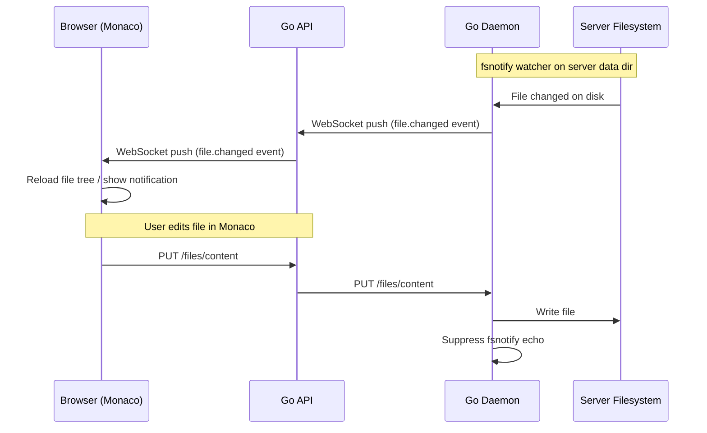

# Modern Game Panel — Strategic Blueprint

## 1. Vision Statement

**Goal**: Build a **1:1 Pterodactyl panel conversion** from the older LAMP stack (PHP/MySQL/Apache/Linux) to a modern, optimized stack — then surpass Pterodactyl with richer features, lower memory usage, faster performance, and easier Linux deployment.

**Not a rewrite from scratch** — this is a **systematic port** where AI agents understand the Pterodactyl source structure and convert it feature-by-feature into the new stack.

---

## 2. Multi-Agent AI Workflow

### Agent Assignment Strategy

```
┌──────────────────────────────────────────────────────────┐
│                    ORCHESTRATION (You)                    │
│   Testing · DevOps · Debugging · Security · Deployment   │
└──────────┬──────────┬──────────┬──────────┬──────────────┘
           │          │          │          │
     ┌─────▼────┐ ┌──▼───┐ ┌───▼──┐ ┌────▼─────┐
     │  Claude   │ │Codex │ │Cursor│ │ Bolt AI  │
     │(Desktop + │ │      │ │      │ │          │
     │ Antigrav.)│ │      │ │      │ │          │
     ├──────────┤ ├──────┤ ├──────┤ ├──────────┤
     │Review &  │ │API   │ │UI    │ │Frontend  │
     │Security  │ │Wiring│ │Polish│ │Prototyp- │
     │File Mgmt │ │Impl. │ │Comps │ │ing       │
     │Analysis  │ │Daemon│ │UX    │ │Panel     │
     │Testing   │ │Store │ │      │ │Design    │
     └──────────┘ └──────┘ └──────┘ └──────────┘
           │
     ┌─────▼──────┐       ┌────────────────┐
     │ GitHub     │       │ CodeRabbit      │
     │ Copilot    │       │ (Review)        │
     │ (VSCode)   │       ├────────────────┤
     │ Main IDE   │       │ Vulnerabilities │
     │ All langs  │       │ Deadlocks       │
     │            │       │ Memory leaks    │
     └────────────┘       │ Goroutine leaks │
                          │ Security flaws  │
                          └────────────────┘
```

### Review Protocol
1. **Each file** gets reviewed by AI individually (not blind bulk prompting)
2. **CodeRabbit** runs on every PR for automated vulnerability scanning
3. **Claude** does deep security analysis (deadlocks, WebSocket leaks, goroutine leaks)
4. **You** handle: DevOps, deployment, testing multiple game servers simultaneously

---

## 3. Pterodactyl → Modern Panel Mapping

### How Pterodactyl Works (Your Deployment Experience)

```
Pterodactyl LAMP Stack:
├── Panel (PHP Laravel)
│   ├── Deployed to: /var/www/pterodactyl
│   ├── Web server: Nginx (reverse proxy)
│   ├── Database: MySQL (migrations + egg seeding)
│   ├── Queue: Redis + pteroq.service (systemd)
│   ├── Cron: * * * * * php artisan schedule:run
│   └── Auth: Laravel Sanctum (sessions + tokens)
│
├── Wings (Go Daemon)
│   ├── Service: wings.service (systemd)
│   ├── Path: /etc/systemd/system/wings.service
│   ├── Config: /etc/pterodactyl/config.yml
│   ├── Runtime: Docker containers
│   └── Data: /var/lib/pterodactyl/volumes/
│
└── Eggs/Nests (Game Templates)
    ├── Imported via panel admin UI
    ├── JSON definitions with install scripts
    └── Seeded into MySQL via migrations
```

### Conversion Mapping

| Pterodactyl (LAMP) | Modern Panel (New Stack) | Why Better |
|---|---|---|
| **PHP Laravel** | **Go Fiber API** | 10-50x faster, 5-10x less memory |
| **MySQL** | **PostgreSQL 16** | Better JSON, better concurrency, better types |
| **Apache/Nginx** | **Go Fiber (built-in HTTP)** + Nginx optional | One less moving part |
| **Blade templates (SSR)** | **Next.js 15 + React 19 (CSR/SSR hybrid)** | Modern SPA, real-time UI, Monaco editor |
| **Laravel Queue + pteroq.service** | **Go goroutines + Redis pub/sub** | No separate queue worker process needed |
| **Laravel Scheduler + crontab** | **Go cron library (robfig/cron)** | In-process, no crontab dependency |
| **Wings (Go)** | **Go Daemon (stdlib HTTP)** | Similar approach, improved runtime abstraction |
| **Artisan CLI** | **Go CLI subcommands** | Single binary, no PHP runtime needed |
| **Composer (PHP deps)** | **Go modules (zero runtime deps)** | Single static binary |
| **npm (panel assets)** | **npm (frontend only)** | Same tooling, but only for frontend |

### Systemd Services (Linux Deployment)

```bash
# Pterodactyl had:
#   /etc/systemd/system/pteroq.service   (queue worker)
#   /etc/systemd/system/wings.service    (daemon)

# Modern Panel will have:
#   /etc/systemd/system/modern-panel-api.service    (API + built-in scheduler)
#   /etc/systemd/system/modern-panel-daemon.service (daemon)
#   That's it. Two services. No crontab. No queue worker.
```

---

## 4. Stack Decisions (Final Answers)

### Gin vs Fiber for API?

**Answer: Keep Fiber.** Here's why:

| Criteria | Gin | Fiber | Winner |
|---|---|---|---|
| Raw throughput | ~60K req/s | ~120K req/s | **Fiber** |
| Memory per request | ~4 KB | ~2 KB | **Fiber** |
| Built on | `net/http` | `fasthttp` | Tie |
| Middleware ecosystem | Larger | Smaller but growing | Gin |
| WebSocket support | Needs gorilla | Built-in contrib | **Fiber** |
| Streaming body | Standard | `StreamRequestBody: true` | Tie |
| Learning curve | Familiar | Similar to Express.js | **Fiber** |
| **Your codebase** | Would require rewrite | **Already using it** | **Fiber** |

> [!IMPORTANT]
> You're already 2,652 lines deep in Fiber handlers. Switching to Gin would be a rewrite with no meaningful benefit. Fiber's speed advantage actually matters for a game panel that handles WebSocket streams, file uploads, and stats polling from hundreds of servers.

**Recommendation**: Fiber for the API, stdlib `net/http` for the daemon (already done — correct choice since the daemon needs raw control over WebSocket upgrades and Docker stream proxying).

### Daemon + Container Runtime

**Answer: Go stdlib HTTP + Docker SDK (already correct)**

```
Current architecture (KEEP):

Daemon HTTP Server (stdlib net/http)
    │
    ├── runtime.Runtime interface  ← abstraction layer
    │   ├── DockerRuntime          ← current (Docker Engine SDK)
    │   ├── ContainerdRuntime      ← future (containerd client)
    │   └── PodmanRuntime          ← future (Podman socket)
    │
    └── Why stdlib not Fiber?
        ├── Daemon needs raw hijacked connections for console attach
        ├── Daemon needs precise control over WebSocket lifecycle
        ├── No CORS complexity (only API talks to daemon)
        └── Minimal dependencies = smaller binary
```

### Python Microservices

**Answer: Yes, but ONLY for non-critical-path tasks.**

```
Python (FastAPI) should handle:
├── 🥚 Egg/Nest import & conversion scripts
│   └── Parse Pterodactyl egg JSONs → convert to modern template format
├── 📊 Analytics & reporting dashboard
│   └── Server usage trends, player counts, resource forecasting
├── 🤖 AI-powered features
│   └── Log analysis, anomaly detection, auto-scaling suggestions
├── 🔧 Installer/automation scripts
│   └── One-click game server setup scripts
└── 📦 Backup management (S3/remote)
    └── Scheduled backup rotation, cloud upload

Python must NEVER handle:
├── ❌ Container lifecycle (start/stop/restart/kill)
├── ❌ Real-time WebSocket streams (console/stats/logs)
├── ❌ File manager operations
├── ❌ Auth/token validation
└── ❌ Any hot path between user click and server response
```

**Deployment**: Each Python microservice runs as a separate container, communicates with the API via internal HTTP or Redis pub/sub.

### Database: PostgreSQL 16

**Answer: Already correct. PostgreSQL advantages over Pterodactyl's MySQL:**

| Feature | MySQL (Pterodactyl) | PostgreSQL (Modern Panel) |
|---|---|---|
| JSON support | Basic `JSON` type | Full `JSONB` with indexing |
| Concurrency | Table-level locks common | MVCC (no read locks) |
| Data types | Limited | `inet`, `uuid`, `jsonb`, `tstzrange` |
| Full-text search | Requires config | Built-in `tsvector` |
| Upserts | `ON DUPLICATE KEY` | `ON CONFLICT DO UPDATE` (cleaner) |
| CTEs | Limited (before 8.0) | Full recursive CTEs |
| Partial indexes | No | Yes (e.g., `WHERE server_id IS NULL`) |

---

## 5. File System Architecture (Surpassing Pterodactyl)

### What Pterodactyl Has
- Basic file list/read/write/delete/rename via Wings API
- Upload via chunked POST
- No live sync, no web IDE, no rsync

### What Modern Panel Will Have

#### a) Live File Sync (Real-time)



**Implementation plan:**
- Daemon runs `fsnotify` watcher per active server
- Changes pushed via dedicated WebSocket channel (`/ws/files`)
- Debounce rapid changes (100ms window)
- Only watch directories the user has open in the file manager

#### b) Web IDE (Enhanced Monaco)

```
Current: Monaco with basic read/write
Target:  Full web IDE experience

Features to add:
├── Multi-tab editing (open multiple files)
├── File tree sidebar with drag-drop
├── Search across all server files (grep-like)
├── Syntax highlighting for:
│   ├── server.properties (Minecraft)
│   ├── YAML configs
│   ├── Shell scripts
│   ├── JSON
│   └── Custom game configs
├── Terminal panel (WebSocket console below editor)
├── Git-like diff view for config changes
├── Auto-save with undo history
└── Collaborative editing (future: CRDT-based)
```

#### c) Faster Uploads

```
Current: 8 MB chunked sequential upload
Target:  Parallel resumable uploads

Improvements:
├── Parallel chunk upload (4 concurrent chunks)
├── Resume on disconnect (offset tracking already exists)
├── Progress per-file and per-chunk
├── Drag-drop folder upload (recursive)
├── Compress-then-upload option (tar.gz client-side)
├── Upload queue with priority
└── Server-side: streaming decompression for archives
```

#### d) rsync Integration via SFTP

```
Current: SFTP sidecar with static credentials
Target:  Panel-integrated SFTP + rsync

Architecture:
├── SFTP auth goes through panel API (/api/remote/sftp/auth)
│   └── Already implemented! Just needs Wings-compatible SFTP server
├── Per-server SFTP credentials (generated from panel)
├── rsync over SSH tunnel to SFTP endpoint
├── Panel UI shows rsync transfer progress
├── Scheduled rsync for server migration
└── rsync for backup-to-remote (S3, another node)

Implementation:
1. Replace atmoz/sftp with custom Go SFTP server
   (github.com/pkg/sftp) inside the daemon
2. Auth validates against panel API
3. Chroot to server data directory
4. rsync client in daemon for node-to-node transfers
```

---

## 6. Memory Optimization Strategy

### Why Modern Panel Uses Less Memory Than Pterodactyl

| Component | Pterodactyl Memory | Modern Panel Memory | Savings |
|---|---|---|---|
| Panel (PHP-FPM) | ~150-300 MB | — | Eliminated |
| Panel (Laravel) | ~80-150 MB | — | Eliminated |
| API (Go Fiber) | — | ~15-30 MB | **New** |
| Queue Worker (PHP) | ~50-100 MB | — | Eliminated (in-process) |
| Wings (Go) | ~30-50 MB | ~20-40 MB | Comparable |
| MySQL | ~200-400 MB | — | Replaced |
| PostgreSQL | — | ~30-80 MB | **Lower** |
| Redis | ~10-20 MB | ~10-20 MB | Same |
| Nginx | ~5-10 MB | ~5-10 MB | Same (optional) |
| **Total baseline** | **~525-1030 MB** | **~80-180 MB** | **5-6x less** |

### Go-Specific Optimizations
```go
// Connection pool tuning (already in place)
cfg.MaxConns = 8      // Don't over-allocate
cfg.MinConns = 1      // Scale down when idle
cfg.MaxConnLifetime = time.Hour

// Fiber optimizations
app := fiber.New(fiber.Config{
    ReadTimeout:       5 * time.Second,
    StreamRequestBody: true,        // Don't buffer uploads in memory
    ReduceMemoryUsage: true,        // Enable aggressive GC
    Prefork:           false,       // Single process (simpler)
})

// Future: per-server resource accounting
// Track memory per goroutine group → kill leaky WebSocket handlers
```

---

## 7. Easier Linux Deployment (vs Pterodactyl)

### Pterodactyl Deployment Pain Points (What You Experienced)
1. Install PHP 8.1+ with extensions (bcmath, curl, gd, mbstring, mysql, pdo, tokenizer, xml, zip)
2. Install Composer globally
3. Clone panel to `/var/www/pterodactyl`
4. Run `composer install --no-dev --optimize-autoloader`
5. Configure `.env` with database, Redis, mail settings
6. Run `php artisan key:generate`, `php artisan migrate --seed`
7. Create crontab entry: `* * * * * php /var/www/pterodactyl/artisan schedule:run`
8. Create `pteroq.service` in `/etc/systemd/system/`
9. Configure Nginx with SSL, PHP-FPM socket
10. Install Wings separately, configure `/etc/pterodactyl/config.yml`
11. Create `wings.service` in `/etc/systemd/system/`
12. **Total: ~30-45 minutes of manual setup**

### Modern Panel Deployment (Target)

```bash
# Option 1: One-line install script
curl -sSL https://install.modern-game-panel.dev | bash

# Option 2: Manual (still simple)
# Step 1: Download single binaries
wget https://releases.modern-game-panel.dev/latest/panel-api
wget https://releases.modern-game-panel.dev/latest/panel-daemon
chmod +x panel-api panel-daemon

# Step 2: Run interactive setup
./panel-api setup
# → Creates PostgreSQL database
# → Runs migrations
# → Creates admin user
# → Generates secrets
# → Creates systemd services automatically
# → Optionally sets up Nginx + Let's Encrypt

# Step 3: On each game node
./panel-daemon setup --panel-url=https://panel.example.com --token=<node-token>
# → Connects to Docker
# → Registers with panel
# → Creates systemd service
# → Starts heartbeat

# Total: ~5 minutes
```

### Key Deployment Differences

| Aspect | Pterodactyl | Modern Panel |
|---|---|---|
| Dependencies | PHP, Composer, MySQL, Redis, Nginx | **Just Docker + PostgreSQL** |
| Binary count | PHP scripts (many files) | **2 static Go binaries** |
| Config files | `.env` + `config.yml` + nginx conf | **Single `.env`** |
| Systemd services | `pteroq.service` + `wings.service` | `panel-api.service` + `panel-daemon.service` |
| Crontab | Required (`schedule:run`) | **None** (built-in scheduler) |
| SSL setup | Manual Nginx + certbot | **Built-in Let's Encrypt option** |
| Update process | `git pull` + `composer install` + `migrate` | **Replace binary + restart** |
| Queue worker | Separate PHP process | **In-process goroutines** |

---

## 8. Feature Roadmap (1:1 Parity + Enhancements)

### Phase 1: Core Parity ✅ (DONE)
- [x] Auth/login + JWT sessions
- [x] Admin: nodes, allocations, templates, users
- [x] Servers: create → install → power → delete
- [x] Console + stats + logs (WebSocket)
- [x] File manager + Monaco editor + chunked uploads
- [x] Backups (zip-based)
- [x] Docker Compose stack + health checks
- [x] Prometheus + Grafana monitoring

### Phase 2: Code Quality (NEXT)
- [ ] Split monolithic files (dashboard.tsx, server.go, store.go)
- [ ] Add comprehensive test suite
- [ ] Fix server selection UX
- [ ] Remove hardcoded demo fallbacks
- [ ] Wire admin UI screens (users, templates, allocations management)

### Phase 3: Full Pterodactyl Parity
- [ ] Egg/nest system with full variable editor
- [ ] API keys for programmatic access
- [ ] SSH keys management
- [ ] Two-factor authentication (TOTP)
- [ ] Activity logs UI
- [ ] Subuser permissions UI (granular)
- [ ] Server database management UI
- [ ] Mount management UI
- [ ] Server schedules UI with task editor
- [ ] Node configuration auto-deploy (Wings-compatible)

### Phase 4: Beyond Pterodactyl
- [ ] Live file sync (fsnotify + WebSocket)
- [ ] Enhanced web IDE (multi-tab, search, terminal panel)
- [ ] Parallel resumable uploads
- [ ] Panel-integrated SFTP server (Go-native)
- [ ] rsync-based server migration
- [ ] Python microservices (analytics, egg converter, AI helpers)
- [ ] One-line Linux installer
- [ ] Single-binary deployment (no PHP/Composer/Nginx required)
- [ ] Built-in Let's Encrypt SSL
- [ ] Auto-update mechanism
- [ ] Multi-game marketplace (community egg store)
- [ ] Real-time collaborative file editing
- [ ] Server resource forecasting (AI-powered)

---

## 9. Reference Repos (Local)

Already present in your project:
- `refs/pterodactyl-panel` — PHP Laravel panel source (behavioral reference)
- `refs/pterodactyl-wings` — Go daemon source (behavioral reference)

### How to Use References with AI Agents
```
Prompt pattern for agents:

"Look at refs/pterodactyl-panel/app/Http/Controllers/Api/Client/Servers/
ScheduleController.php. Understand the exact behavior: what it validates,
what it persists, what events it fires, what permissions it checks.
Now implement the same behavior in our Go Fiber handler at
apps/api/internal/http/handlers_schedules.go using our store layer."
```

This pattern works because:
1. AI reads the PHP source → understands the **behavior**
2. AI maps Laravel patterns → Go patterns (Eloquent → raw SQL, FormRequest → struct validation)
3. AI preserves the **user experience** while changing the **implementation**

---

## 10. Naming Conventions

| Pterodactyl Term | Modern Panel Term | Notes |
|---|---|---|
| Panel | Panel API | Same concept |
| Wings | Daemon | Same concept, new name |
| Nest | Nest (keep) | Game category |
| Egg | Template/Egg (keep) | Game server definition |
| Node | Node (keep) | Physical/virtual server |
| Allocation | Allocation (keep) | IP:port binding |
| Subuser | Subuser (keep) | Shared server access |
| Location | Location (keep) | Geographic grouping |
| pteroq.service | (none needed) | Built into API binary |
| config.yml | .env | Simpler flat config |
